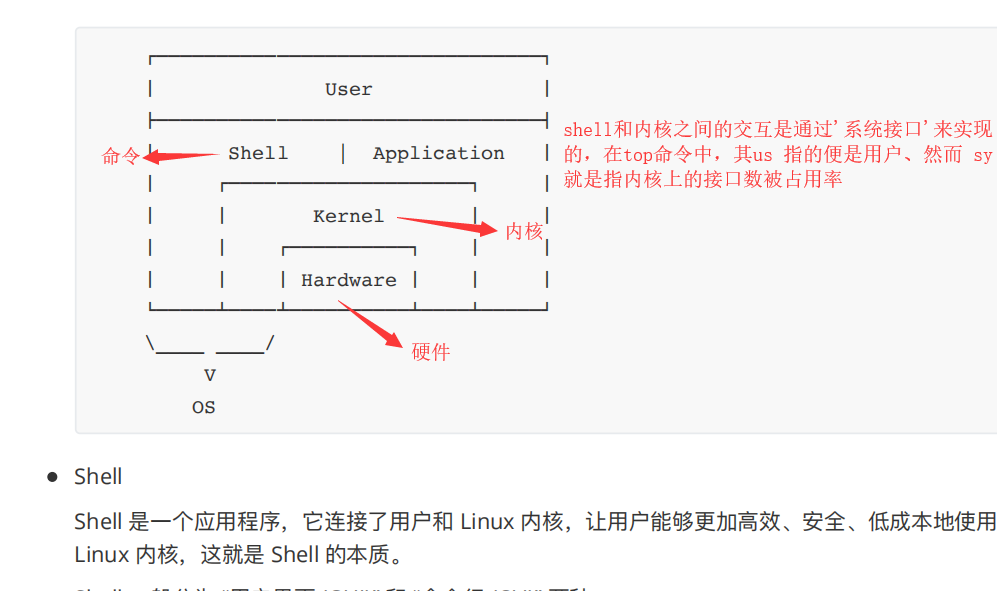
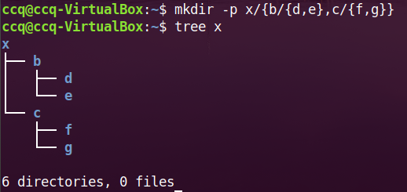

### 一、Shell命令

+ 一个应用程序，**连接了用户和linux内核(kernel)**，用户在命令行中输入的命令，shell来实现（shell相当于外壳）然后shell在与内核交互。
+ 带界面的shell （GUI shell）
+ 纯命令行的shell  （CU shell）`
  - sh：1978最早的
  - csh：1979岁BSD发布
  - bash：目前最流行的bash，都是大多数系统的默认的shell
  - zsh：中功能最全的shell，安装sudo apt install -y  zsh  
+ 通过`cat /etc/shells `查看当前的shell类型。
+ 

### 二、Bash快捷键

```
ctrl + f  前进一个字符 方向键也可以
ctrl + b  后退一个字符
ctrl + e  回行首
ctrl + w  向左删除一个单词
ctrl + u  向左删除全部
ctrl + k  向右删除全部
ctrl + y  粘贴上一次删除的内容
ctrl + l  清屏
```

### 三、目录结构

在linux中硬盘是挂载在根目录上。命令`df`可以知道`/dev/sda1`就是指该目录挂载在硬盘。在系统有多个/dev/sda2、/dev/sda3 那么系统是 认为多个设备。


**touch**  后面指定路径会给该路径下创建文件

```
//cd命名操作
cd  ../ 返回上一级目录  也可以接着../../回两层
cd -  切回到上一次操作的目录
```

bin  存放普通用户的GNU命令

sbin 存放管理员级别的命令   比如mkfs 格式化，分区

usr 用户的资源目录 

​		bin  存放用户级的命令

​		sbin  存放管理员用户的命令

​		local

opt 第三方开发的程序，存放第三方的包

**dev** 跟设备相关的目录，一切皆文件

​	**/dev 里面黄色的都是设备文件**。mem内存文件、bus主线文件、net网络文件、null任务文件在里面是被视为丢弃的、zero 读取的是0、**random产生随机** 、shm内存文件，/dev/shm 写到该文件的内容是被做当做缓存的。

```
fp = (open("/dev/random","rb"))
print(fp.read(10)[0])  =>随机产生10个随机数
注意：此时读取的10个数，需要用[]来获取数据
在python中使用random模块的随机是一个伪随机。
然而用随机文件产生是接近真随机，从应用池中采集一些声音的信号转为二进制存放在该文件中(熵池)，因为这些声音，电流等信号是随机的，
```

### 打印内容

**echo** ”abcdefg“    打印abcdefg

echo “abcdefg” **>** abc  得到在home目录生成 abc文件，把内容写入到了abc文件里面，该文件可以指定路径。

**查看文件内容**：cat  abc   会打印abc文件的内容

echo “xxxx” **>>**abc   两个箭头是 追加 内容，

如果：echo “asddad” > **/dev/null**  那么写入了null中，那么该**文件就是被丢弃了打印不了。**


etc   系统配置文件目录

proc  进程相关的信息

```
里面带有很多数字标识，实际上每个数字都是一个文件夹
cat hostname  得到主机名
cat /proc/cpuinfo   //可以得到cpu信息
	里面的processor 指的处理器，即cpu(从0开始算的)
cat /proc/cpuinfo | grep processor 
```

root     ctrl+d 退出超级管理员

home  家目录

**media** ：系统会自动识别一些设备，比如u盘、光驱等，识别成功会，把该设备挂载在这个目录下面


### 四、目录操作

+  绝对路径：/ 开头的一层一层进入
+ 相对路径：../

**ls -l -h**   把一个文件下的文件**大小以k单位显示**

+ 隐藏文件-->在文件名开头加个 **.**

**ls -A**    会显示所有文件，A指的就是all

+ **mkdir**  yyy     /  创建目录
+ **mkdir -p**  a/b/c/d/f   ==>创建了一条树，注意需要加个  **-p**
+ `mkdir -p x/{b/{d,e},c/{f,g}}`  ==>多个子目录，利用**{}**有下级的话不能丢**/**
  
  - 通过**tree** 指定到目录便可以查看该树
  
    
+ **touch a/b/d/{x,y,z}**  **创建空文件**,这里创建了3个空文件
  
  + 如果对于存在一个文件，tough不会创建该空文件。
+ **rm**  不能删除目录,
+ rm **-r**  yyy/  .xxx/  加个**-r**就可以删除

###   五、文件操作

+ cat  文件名      查看该文件内容
+ **mv**  文件名  ~/a/c/     ==》把文件**移动**到指定目录下

+ **cp**    文件名   目标目录    ==> **复制**文件，
+ 如果**复制文件夹**，需要在cp 后面加个 **-r**，
+ 给**单个文件改名字**，也用mv
  - mv  x  zzz       ==> 把文件**x 改成了 zzz**
  - 注意1：如果两个文件1、2，使用mv 1 2  那么2中内容被1覆盖，，
  - 注意2：在mv 前面加个 **-i**  会提示你是否覆盖，比如  mv -i  1  2    会提示是否覆盖2
  - 参数：
    - -i    覆盖前提示
    - -f   强制删除
    - -n  文件存在，停止操作
    - -r   递归对文件夹操作(mv 不需要-r)
+ **软链接**(创建快捷方式)
  - 软链接  -s    如：**ln -s**  zz   yyy    ==>把yyy指向zz，yyyj就是快捷方式
  - **ln  -s**   文件绝对路径   软链接名  ==> 用**绝对路径可以防止出错。**不管在哪个目录创建软链接都可以用的。软链接名开头加个~/yyy 指的在home中创建链接。
  - **在软链接中对数据造成修改，会影响源数据**。删除软连接也不会造成影响。

+ **硬链接**   没有 -s
  - **ln** zzz  ~/hard    ==》创建硬链接名为hard的连接，里面是有数据的，不像软链接，需要绝对路径。**不需要  -s**（注意：和源文件共用一段内存空间）
  - 注意：**删除源文件，对产生的硬链接不会影响**。但是**修改**硬链接的是数据，那么所有的同源数据也**会发生改变**。
  - 一个文件可以多个硬链接，

**文件名没有记录文件的本身，其实只是记录在数据在内存的编号inode，** 然而硬链接时开辟了一个内存空间(有点类似复制)指向inode；然而软连接时指向文件的，然后在通过文件来指向inode，其自己不会直接指向incode。

+ **tar压缩文件**（利用终端操作）
  - tar  -czf    压缩名称.tar.gz  被压缩文件
  - 多个文件压缩在一起：   tar -czf   压缩名.tar.gz   文件1  文件2 ……
+ tar解压缩 
  - tar  -xzf    文件.tar.gz      （对文件解压缩）  7z
+ **zip 压缩**
  + zip   -r  压缩包名.zip   需要压缩的文件1  文件2 等
+ zip 解压缩
  + **unzip** 压缩包名.zip

### 六、查找操作 find

比如**查找所有的txt文件**，

​	find  **./ -name** "*.txt"     (./ 指当前的目录下)

**只要目录不要文件**  **-type  d**

​	find ./ -type d   

**只要文件，不要目录**   **-type f**

​	find ./ -type f  

选出小于 1 kb的文件  1k  (小于不用写成 -1k)      、如果大于使用 +1k

​	find ./  -size  1k 


选出大于1k并且小于2k文件    

​	find ./ -size  +1k   -size -2k     （也可以不用写 - 号）参数不能为小数

**查找软连接   -type l**

查找权限   -prem 0644      （0755 对自己什么都行，其他可读可执行）

