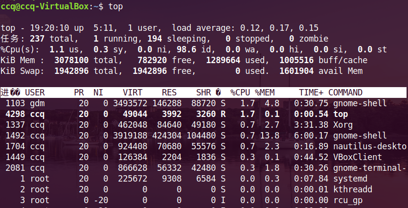
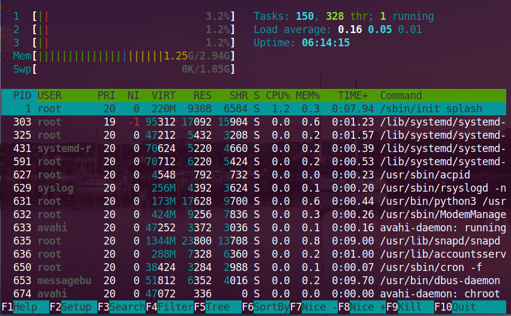
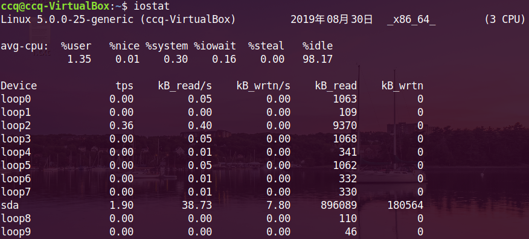
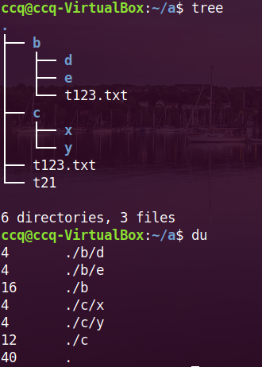
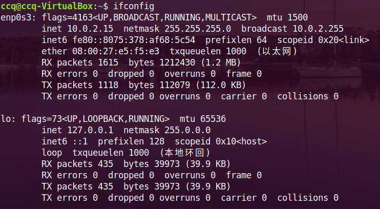
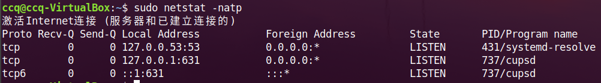
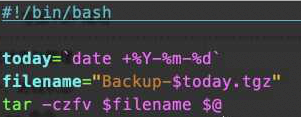

### 一、进程状态

分时多任务系统 ：如下的时间片原理，linux系统

时间片：电脑多个进程，把时间切成片段，这个时间片段是越小越好，多个任务在这片段中切换，肉眼看不出的。（这种情况是并行的，任务数远远大于cup内核数量）核

**`ps`  命令** 

​	进程状态(process status)、

```
ccq@ccq-VirtualBox:~$ ps
  PID TTY          TIME CMD
 2867 pts/0    00:00:00 bash
 2876 pts/0    00:00:00 ps
 // PID  进程号
 // TTY  当前终端的类型
 //TIME  占用cpu时间，这里是一瞬间看不出来的
 //CMD    命令
```

参数：

+ -e   ==>指定显示所有运行在系统上的进程
+  -f   ==>扩展了输出

ps支持3种风格

+ Unix   ==> 前面加  -   如 ps -ef
+ BSD   ==>  不加  -       如 ps  ef
+ GNU   ==>   前面加2个 --    如 ps --ef

#### 1、`ps -ef`

```
// ps -ef 命令的消息
ccq@ccq-VirtualBox:~$ ps -ef
UID        PID  PPID  C STIME TTY          TIME CMD
root         1     0  0 08:59 ?        00:00:03 /sbin/init splash
root         2     0  0 08:59 ?        00:00:00 [kthreadd]
root         3     2  0 08:59 ?        00:00:00 [rcu_gp]
root         4     2  0 08:59 ?        00:00:00 [rcu_par_gp]
root         6     2  0 08:59 ?        00:00:00 [kworker/0:0H-kb]
// UID  当前使用进程的用户名
// PID  进程号，按照小到大排序
// PPID  ppid里的值是的是父进程pid，如（0）指系统最初始化的进程
// C     占用cpu的利用率
// STIME 启动时间
// TTY
// TIME  是占用cpu的时间
// CMD  进程运行的命令
```

#### `2、ps aux`

```
ccq@ccq-VirtualBox:~$ ps aux
USER       PID %CPU %MEM    VSZ   RSS TTY      STAT START   TIME COMMAND
root         1  0.0  0.2 160080  8908 ?        Ss   08:59   0:04 /sbin/init splash
root         2  0.0  0.0      0     0 ?        S    08:59   0:00 [kthreadd]
root         3  0.0  0.0      0     0 ?        I<   08:59   0:00 [rcu_gp]
root         4  0.0  0.0      0     0 ?        I<   08:59   0:00 [rcu_par_gp]
root         6  0.0  0.0      0     0 ?        I<   08:59   0:00 [kworker/0:0H-kb]
//和 ps -ef 有点相同的地方
// MEM  内存占有率
// VSZ  虚拟内存调用 （window中：当内存小，把硬盘上划分一块空间来当内存使用，速度慢 ，非常类似于Linux 中的 Swap 分区；  Linux中：当程序需要写大量数据，需要向操作系统请求内存，然而在在linux中有个虚拟内存层，程序会直接向该虚拟内存层中写入数据，然后linux在将其虚拟内存的数据映射到实际内存中）
// RSS  物理实际内存
// STAT 进程状态
	第一个字符表表明进程的状态：
		o  正在运行
		s  在休眠
		R  可运行，正在等待CPU
		z  僵尸进程  关都关不了的进程
		T  停止状态
	第2个字符是前者的进程状态细节
		< 该进程高优先级
		N  低先级
		L  该进程有页面锁定在内存中
		s  管理和控制别的进程
		l  表示多线程
		+  代表正在运行该前台进程，默默的运行，为其他进程提供服务

技巧：
找到python的进程 Id号
	ps aux | grep python | awk '{print $2}'
pgrep 是专门过滤进程，
  	pgrep python   ==> 上面得到的id号是包含pgrep里面id

```

`pgrep  进程名  `  ==> 这是完全匹配一个进程，并不是像上面的grep一样(含有该字样会返回这个进程)。  **pgrep 直接返回了该进程的ID**

**nice  调整程序的优先级** 

#### 3、`top   `

​	top的显示信息如下：头部信息，可以直观看出计算机的信息



```
第一行：开机时长，用户登录数量、load average——查看负载: 3个值分别是1分钟、5分钟、15分钟，该值最好不要系统的cpu核心数，假设超过该数量，说明此时cpu的压力过大，任务的数量太多，cpu处理不过来。。。命令uptime也可以直接查看负载信息。

第二行任务(Tasks)：总任务数、正在运行数量、休眠数量、停止、僵尸进程

第三行(%cpu)：us——用户程序占用cpu量、sy——系统程序占用cpu量、id——(idle简写) 当前cpu剩余的空闲量。这三者比较常用。
在top命令中 按 1 就可以显示全部 CPU 信息。

第四行(KiB Mem): total——内存总量、free——空闲内存、used——用户使用的内存、buff/cache——缓存区占用的内存。
注意：可用的内存 = free + buff/cache

第四行Swap：交换区的占用情况，当内存不足的时候，会使用该区域的内存，速度慢(类似window的虚拟内存)。

第五行：进程的具体信息，注意上图的出现问号处，第一处：进程ID——PID、第二处：S——进程状态。
具体分别：PID,USER、PR——进程的优先级、NI——进程的谦让度(数值越小优先级越小)、VIRT——虚拟内存、RES——物理内存、SHR——共享内存(主要用于进程之间的交互的媒介)、S——进程状态(R运行、S休眠、I、Z僵尸)、CPU——进程cpu占用率、MEM——进程内存占用率、TIME+——进程运行的时间、COMMAND——进行执行的命令

```

在**top**中查看**指定的进程的信息**：

```
top  -p  进程号1,进程2，……    //可以直接显示指定进程的状态
```

#### 4、**`htop`** 

ubuntu系统需要安装 htop命令 `sudo apt install htop`



**特点**：**支持鼠标操作**、功能强大、可视化程度高

绿色层上部分： 相当于top的头部信息，

下一层有功能栏：比如==>过滤出python进程  点击Filter输入python，直接找到python相关的进程。

F5 是进程树状结构，双击收缩树枝

杀死进程： 选中进程，点击F9 kill，需要释放资源(信号量)选9


### 二、进程管理

+ **`kill`**：杀死进程，**实质上给进程发送信号**
  + kill  进程ID    ==>已终止  相当于发送 15 （软件终结信号）
  + kill  -9   进程ID    ==>已杀死  发送 9 （操作系统主动强制杀死）
+ 参数
  + -1   (HUP)平滑重启软件 （重启该进程，该进程的Id不变，子进程会变）
  + **-9  (KILL)   强制杀死**
  + -15 （TERM） 正常终止 ，**默认信号**

+ **`pkill`**  按照进程名字处理
  + pkill  python     ==>正常终止
  + **能够匹配的进程名称都会被关闭**，名称是完全匹配的。（谨慎使用）
  + 也支持 kill 参数 
  + **`killall`**   和pkill相似，按照名称处理

### 三、内存状态

+ **uptime**   可以观察系统的负载信息

+ **查看内存状态** ` free -m `   ==>-m 以单位M显示、g以单位G显示

  ```
   总计       已用        空闲      共享    缓冲/缓存    可用
   total     used       free    shared  buff/cache   available
  ```

  + 内存(Mem) :  显示当前内存的信息
  + 交换区(Swap)   当内存不足，会申请硬盘来存数据。能不用就不用，速度慢

+ **查看硬盘状态**   `iostat`       ==>i （input） o（output）

  + `iostat  `  

  

  + 速度，每s读取多少K，meiS写入多少K，一共读取多少K，一共写入多少K
  + **sda 指的是硬盘**  、其余的指的是虚拟的
  + `dd if=/dev/zero of=xxx bs=1M count=1024`   ==>**生成一个大文件**
    + if 是input file   写入文件 (这是指写入的数据)写/dev/zero里面都是0
    + of 是输出文件，xxx 文件名， （输出到xxx中，可以指定路径）
    + **bs  块状**   ，上面是 1块 1M
    + count  字节数   ，**大小就是 bs *count**  就是文件的大小 (这里是1G)

+ **查看硬盘的数据内存：**

  在硬盘中，**存数据是以块状形式来存储的**。比如传送数据，很多小文件的速度却比一个大文件的速度慢，就是因为这些每个小文件都占了1块空间。

  + `df -lh`  ==>**查看硬盘分区，以及每个分区的剩余空间**。
  + `ls -lh` ==> 查看当前文件的内存，**如果是文件夹不会显示文件夹内部内存。**
  + `du `  ==> 得到该文件夹下的所有文件的大小、以及相对路径
    + 
  + `du -hs 文件夹`   ==> 查看该**文件夹里面的占用内存大小**
    + `du -hs ../` ==>**上一个文件夹**的大小
    + du  **-h**   带单位   以K单位
    + du  **-s**    查看文件夹的大小，默认字节

### 四、网络状态

本机IP地址、本机端口号（从哪里出去）、对方IP、对方端口号

+ `ifconfig` **查看网卡状态**，检查自身IP地址，(**sudo apt install net-tools**)

  

  + **enpos3**  ==>虚拟机给配的一个网卡；**下面介绍主要的属性**
    + mtu  - - 单个报文的大小(tcp数据报文)
    + inet   - - 网卡绑定的地址（），netmask 子网掩码，broadcast 广播地址
    + ether  网卡物理地址 MAC地址
    + RX 接收
  + **lo**   ==>本地回环，负责本机和本地的连接，每个都有这个lo
  + 管理网卡
    + `sudo ifconfig  网卡名  down `  ==> 把网卡关了

+ `sudo netstat -natp` **查看网络连接的状态**

  

  ``` 
  Proto 指的是协议（tcp-Ipv4,,tcp6-IPV6）
  Recv_Q  接收队列大小
  Send-Q  发送队列大小，如果有值，说明还没有发送完
  Foreign Address  目标的IP地址及端口号
  State   状态，其中有Listen(监听)，ESTABLISHED(正在保持连接的状态)
  PID/Program name  进程ID 程序名
  
  问题：服务器的9000端口被占用，如何找出谁占用？
  netstat -natp | grep  9000  
  ```

  + 参数  平常使用 -natp
    + -a   显示所有选项
    + -t   显示tcp相关的
    + -u  显示udp 相关的
    + -x   显示套接字有关的
    + **-n**  拒绝显示别名（**速度变快**）**直接显示数字**
    + -p  显示建立相关连接的程序名
    + -l   显示所有状态为 listen监听状态
    + -c   每隔一段时间执行一次该命令
    
  + 例子：

    +  根据进程pid查端口：

      `netstat -nap | grep pid`

    +  根据端口port查进程

      ` netstat -nap | grep port`

  + **ping**  服务器地址  (icmp协议 => IP协议基础之上，不能携带太多东西，只是接收个包发送出去)31tr`

  + 参数 

    + -i 是指速度 ，比如 -i  0.5  ==> 0.5s 一次
      + ping -i 0.5  www.baidu.com
    + -c  控制包的数量，比如 -c  4  ==> 指包的数量达到4 停止 
      +  ping -c 4  www.baidu.com
      + 合并：ping -i 0.5  -c 10  www.baidu.com   ==>0.5s一个、达到10个停止
    + -q  只显示结果，不显示过程

    

+ lsof   查看端口的程序  (注意前面加个权限 sudo)

  + `lsof -i ：PORT`  查看占用端口的程序
    + 可以看端口被哪些程序占用
  + `lsof -i tcp`  返回所有tcp的连接
  + `lsof -u adc ` 查看用户abc 打开的所有文件
  + `lsof -p 123 ` 查看pid为123的进程打开的所有文件

+ 路由追踪

  + `traceroute  baidu.com`   ==>**查看访问百度的整个路径**

+ **DNS 查询**  （计算机不知道baidu.com，需要利用DNS域名解析，计算机拿到地址，然后计算机通过一些**域名地址解析**。比如一些阿里域名服务器等，查询完之后通过网线会给计算机一个对应域名的地址，然后计算机对该地址进行访问）(一个域名可以多个地址)

  + **dig** [DOMAIN]
    + `dig baidu.com `  ==>可以得到该域名的ip地址，百度有两个地址。
  + host [DOMAIN]
    + `host baidu.com` ==>同样也是得到域名的地址，只是显示的不一样的。
  + nslookup [DOMAIN]

### 五、时间和日期

+ `date`     显示当前时间和日期
+ `cal`       显示本月日历
  + cal  -3    ==>打印三个月的
  + cal  -y    ==>打印整年的
+  `time`    cpu的占用时间
+ 文件备份，添加时间
  + 

  + 

  + 上图脚本中 $@ 与 $* 一样的意思，那么可以传入多个文件，同时处理多个文件。

### 六、下载

+ 服务器下载最新的第三方包
  + 1.取对应官网找到对应软件的的链接
  + 2.`wget  链接`  直接下载该链接下内容
  + 
+ curl https://www.baidu.com/
  + 利用 curl 把该网页的源码显示出来
  + `cutl https//www.baidu.com/ .tar.gz > 压缩包名.tgz`   ==>把下载的内容保存到文件中 
+ mdsum  
  + 判断文件是否一致
    + `md5sum  文件1  文件2`
    + 如果两个值相同的话，说明内容是相同的
+ `ssh  服务器名@服务器IP   `   ==>登录指定服务器
+ **scp**   从远程服务器下载文件到本地、本地上传到服务器
  + `scp  服务器名@服务器ip:下载文件路径   ./ `
  + `scp  ./本地文件路径   服务器名@服务器IP:保存在服务器的路径`