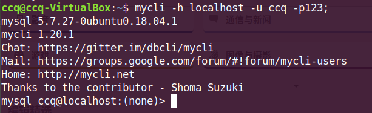
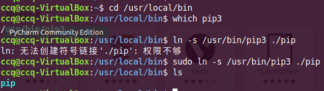
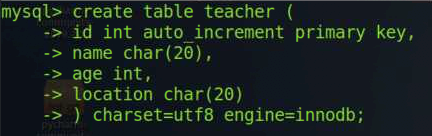
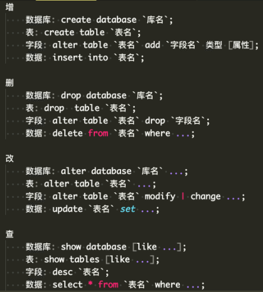

### 一、数据库模型

#### 1、层次模型

优点：查询分类的效率比较高

缺点：没有导航结构，分类困难。数据不完整性。

+ **数据完整性**：指数据库中的数据在逻辑上的一致性、正确性、有效性和相容性。完整性是由各种各样的完整性约束来保证的 。所以数据库的完整性设计就是完整性约束设计。

#### 2、网状模型

还是没有解决导航问题，但是解决了数据的完整性。

#### 3、关系模型

每张表都是独立的，没有导航结构。

表和表之间建立公共的字段，这样该两张表之间就建立了关系。

解决了数据的完整性，也解决了导航问题，但是效率不高。

非关系模型数据库：MongoDB、Redis。

### 二、数据库的术语

+ 数据库：一种关联表的集合。

+ 数据表：在一个数据库中的表看起来像电子表格。

+ 列: 包含相同类型的数据。

+ 行：一行也就是 元组或记录。一组各列组成的相关数据。

+ 冗余：存储的数据出现重复的情况。

+ 主键：primary key ，是唯一的。

+ 外键：外键是用来关联两个表。（下面是主键与外键的例子）

  + 学生表(学号，姓名，性别，班级) 
    其中每个学生的学号是唯一的，学号就是一个主键 
    课程表(课程编号,课程名,学分) 
    其中课程编号是唯一的,课程编号就是一个主键 
    成绩表(学号,课程号,成绩) 
    成绩表中单一一个属性无法唯一标识一条记录，学号和课程号的组合才可以唯一标识一条记录，所以 学号和课程号的属性组是一个主键 

    成绩表中的学号不是成绩表的主键，但它和学生表中的学号相对应，并且学生表中的学号是学生表的主键，则称成绩表中的学号是学生表的外键 

    同理 成绩表中的课程号是课程表的外键 

### 三、SQL语言

+ **结构化查询语言**

  定义数据时表的结构是先规定好的，然后在插入数据。

  非结构化：比如json，MongoDB就是非结构化，它存的就是json数据

+ **关系型数据库**

  | 数据库                 | SQL类型          | 公司               |
  | ---------------------- | ---------------- | ------------------ |
  | Access                 | SQL              | 微软               |
  | SQL-Server             | T-SQL            | 微软               |
  | Oracle                 | PL/SQL           | 甲骨文             |
  | MySQL                  | My/SQl           | 甲骨文             |
  | SQLite(开源的)         | 内嵌型小型数据库 | 移动前端用的比较多 |
  | PostgreSQL(开源最强的) | 即强大又稳定     |                    |

  mysql核心的配置：/etc/mysql/my.cnf         my.cnf指的是个人的配置

+ **1、安装mysql**

  + `sudo apt install -y mysql.server mysql.client`

  安装完，会自动的运行mysql

  **`ps aux | grep mysql`**   ==>此时该进程是以d结尾的，代表着服务进程，即为：daemon守护进程

+ **2、Linux数据库的开启和连接**

  1、开启数据库服务

  ​	Ubuntu：`service mysql start|stop|restart|status `

  ​	其中 start 开启，stop 停止，restart 重启

  ​	system  ctl =>ctrl 控制 

  ​    Deepin：`systemctl start|stop|restart|status mysqld`

  ​    CenOS7: `systemctl start|stop|restart|status mysqld`    

  ​	CenOS6:`service mysqld start|stop|restart|status`

+ **3、连接**

​	`mysql -h localhost -P3306 -u root`   通过root用户，进入并创建新的用户和密码。如下所示

​	-h连接主机ip、-P端口号(默认端口3306可以省略)、-u 是用户名，-p 密码

```
-- 创建新⽤户，并设置密码
-- *.* 代表该⽤户可以操作任何库、任何表
-- 主机名可以使⽤ '%', 代表允许该⽤户从任何机器登陆
GRANT ALL PRIVILEGES on *.* to '⽤户名'@'主机' IDENTIFIED BY "密码" WITH GRANT
OPTION;
-- 前面一段赋予权限，第一个*指数据库，第二个*指表，也就是当前的用户可以操作数据库和表， 后面身份， 结尾：可以身份在授权给别人，否则该用户只能自己和自己操作。
-- 刷新使权限⽣效 
flush privileges;

数据库中注释， --注释内容  /*注释内容*/
上面是设置了用户及其密码
```

如果配置了mycli后，可以直接使用命令直接登录mysql。在该下面编写代码是具有提示的。如何配置mycli环境？



+ 配置myccli：

  + 1、安装pip3,，`sudo apt install python3-pip`
  + 2、此时终端输入pip3就可以使用了，为了方便使用，给pip3做个软链接pip，（放到用户中的bin目录下，/usr/local/bin),需要找到下载的pip3位置（which pip3）

  

  + 3、安装mycli   `pip install mycli` （这是python包，但是不是在python中用，是用python写的）

  + 4、由于下载的包位置（~/.local/bin/)，没有在环境变量中，那么需要设置，编辑  ~/.bashrc 内容。添加内容自定义配置：

    `export PATH=$HOME/.local/bin:$PATH` 

    

    定义全局变量，PATH，这里是字符串拼接，把**下载的包的路径**拼在了家目录和环境变量变量中。

  

  + 通过上述方式创建了用户和密码。可以直接用于mycli运行数据库

+ **4、退出mysql**

​	`exit、quit、\q、ctrl+d`

+ **如果密码忘了该如何操作**？

  + 1、打开配置：`vim /etc/mysql/my.cnf`

  + 2、添加下面内容：

    + ``` 
      [mysqld]
      skip-grant-tables
      
      //如果已经有[mysqld],那么直接写后面内容
      ```

  + 3、修改完成后，保存退出，

    + 重启服务：`sudo systemctl restart mysqld`

### 四、Mysql操作

​	`show databases;`  显示用户的数据库信息。

注意分号; 必须写

#### 1、创建数据库 database

​	`create database abc;  ==> 创建了数据库 abc`

​	可以一些字符集，防止中文乱码，mb4(一个中文4个字节)

​	`create database abc charset=字符编码(utf8mb4)`   ==>这里的mb4类似于utf-16，4个字节。

#### 2、删除数据库  drop 

​	`drop database abc;  `   ==> 删除数据库 abc

#### 3、进入数据库 use

​	`	use 数据库名`    ==> 切换到指定的数据库

#### 4、修改数据库 alter

​	`alter database 数据库名 charset=utf8; `  ==>利用 **alter** 把数据库的字符集修改了，建议在创建数据库时，加个字符集。


### 五、表的操作

#### 1、创建表

`create table if not exists  表名 (`
				id int auto_increment primary key ,
				name char(20),
				age int,
				address char(20)
 			`) charset=utf8  engine=innodb;`

​	 **if not exists**  是判断后面的表是否存在，如果存在不创建，
auto_increment  表示自增长，primary key 主键，一个表只有一个主键。

​	表名可以使用 **反引号** ，避免与关键字冲突



**显示所有表**   `show tables;`

**查看表信息** `desc teacher;`   

**查看表的数据**

`select * from 表名`


#### 2、修改表

`alter table 表名 rename 新表名; `  ==>rename 重命名

`alter table 表名 add sex char(4); `   ==>表里面添加了 **一列sex数据。**

`alter table 表名 add sex char(4)  frist;`  ==>插入字段**第一列**

`alter table 表名 add sex char(4)  after  指定字段; `  ==>插**入到指定字段的后面**

**modify 修改类型**： 

​	`alter table 表名 modify  sex  int；`  ==>利用modify 。把原先的sex类型改成了int类型

**change 修改字段的名字**，比如sex 改成

`alter table teacher change sex  new_sex int`;  ==> 利用 change 改字段的名字

**修改字段的位置** 也是通过 change 

`alter table teacher change xxx xxx int after sex`； ==>把字段xxx放到了 sex的后面

**删除指定字段**

`alter table 表名  drop  字段名;`

**修改表的引擎**

`alter table teacher engine=myisam;`  ==>利用engine，原先的innodb改成了myisam

**移动表**  **rename to**   ==>移动到指定的数据库中，并赋表名

`alter table 表名 rename to 数据库名.新表名； `

**复制表**  结构加数据 用select 读数据 （注意：复制得到的表不会得到主键、与自增长）

`create table 新表名 select * from 被复制表名 ；`   

**复制表结构 ** like  （不会复制数据，会把结构都复制过来）

`create table 新表名 like  被复制的表名`

#### 3、插入数据 insert

+ **全列插入**(每列都要插个值)

  `insert teacher values(1,'make',33,'河北');` 

+ **缺省插入** （有默认值的列不需要插入数据）

  - `insert into 表名（列1，列2，……）values（值1，值2，……),(值1，值2.……)`说明：对应的列插入对应的值示例：insert into nember(name,age,address)values("mimi",18,"东莞")
  - `insert into 表名 set  字段1=值1，字段2=值2`

+ 同时**插入多个**数据

  - `insert into teacher values(1,'make',33,'河北'),(2,'make',33,'河北'),(3,'make',33,'河北');`   	

+ 手动复制

  + `insert into 表1 select * from 表2`  =>把表2内容**插入到了表1**

#### 4、查询数据 select

`select * from  表名`

`select  字段1 字段2 from 表名`

`select  * from 表名 where 条件;`

​	条件比如：id in (2,3,7)  =>打印id 为 2 3 7 的数据。

#### 5、更新数据 update  ……set……

`update 表名 set 字段1=值 ` ==>注意，这里没有添加条件，会把整个字段的都改了。

`update 表名 set 字段1=新值 where 条件； `

`update 表名 set 字段1=值1，字段2=值2 where id=5` ==>修改多个字段的值。

#### 6、删除数据 delete 、 truncate

`delete from 表名 where 条件;`  ==>不加条件会把整张表内容都删除了。

注意：只是表里面的数据，表结构还是存在的

`truncate 表名`   ==>直接一次性清空表里数据，不会显示几条被处理。delete from 是一行一行被删。

区别：truncate 删除不会记录到日记里面。delete会记录在日志中。

​			数据量大的话，truncate速度快

两者本身对表的结构不会产生影响。

```
delete from 表1 where id (7,8)  //7，8 这是是最后2条
//利用缺省插入
insert into 表1（字段1，字段2） values(值1，值2),(值1，值2)

//你会发现：删除后，你在插入两条数据，其id是9、10，并不是在原先的7、8位置了。这样是方便数据的完整性安全性。

前提：如果我们指定的字段为id ，插入的id是删除的id号，那么这个id是可以插入并会回到原先删除的位置，并不会使用自增长。如果不规定id，那么其会默认加一个数据其id就加1。
```

#### **总结：**

