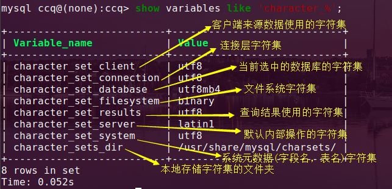
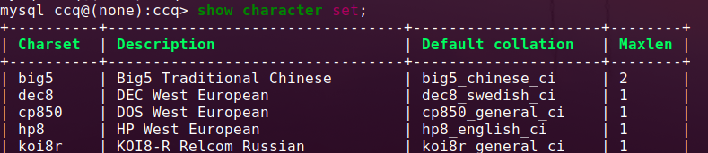
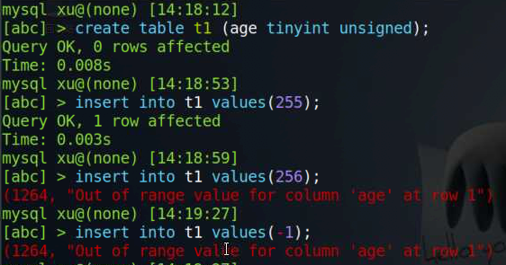
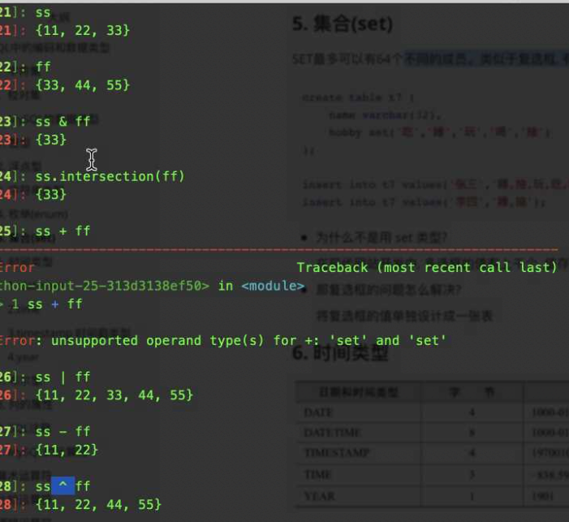

### **Mysql 工作模式**

客户端：接收用户的数据-->传输到服务器-->经常处理-->传给客户端-->展现给用户。

### 字符集

​	ASCII 码 ：采用1个字节的低7位表示字符。

​	Latin1 码 ： 是对ASCII的修改，采用高7位来表示。

​    GB2312 : 国标码 ，简体中文，一个汉字最多占2个字节

​	GB：只是所有中文，也是2个字节

​	UTF8：国际通用编码，一个汉字 3个字节

​	mb4 ： 相当于utf16  ，2的4次方，一个汉字 4个字节

```
gbk字符的最大长度  65525/2-1 = 32766  (行最大容纳65525字节，一个汉字是2个字节，除以2，加1 ，得到的就是 gbk 最大长度 32766)
```

查看mysql 系统 支持的字符集

```
mysql> show variables like 'character_%';   ==>查看字符集，如下图所示
其中：binary 是指二进制
	sever服务端 是默认使用 latin1 编辑
	其余的一般默认是utf-8
```



修改SQL的字符集（只是**临时的修改**，重新登录就无效了）

```
set name gbk;  ==>把字符集都改成了 gbk（除binary、latin1）

set character_set_server = 'utf8'  ==>修改指定的字符集（上面表格中的Variable_name）

```

###  校对集

在某一种字符集下为了能使字符之间的可以相互比较，让字符和字符形成一种关系的集合，称为校对集。

不同字符集有不同的校对规则，命名约定：以其相关的字符集名开始，通常包括一个语言名，并且是通过 `_ci、_cs、_bin`结束的。

+ `_ci`大小写不敏感

+ `_cs`大小写敏感

+ `_bin` 直接比较字符的编码，可以认为是区分大小写。

+ 如何在设置校对集

  + ```
    create table t1(
    	str char(4)
    ) charset=utf8mb4 collate=utf8mb4_general_ci; ==> _general_ci 后缀的都是不区分大小写。
    
    create table t2(
    	str char(4)
    ) charset=utf8mb4 collate=utf8mb4_bin;  ==>看到后缀边是_bin 都是区分大小写的
    ```

+ 如何查看 字符集和 校对集

  + `show character set;`   ==>可以查看字符集和校对集
  + `show collation;`   ==> 显示所有的校对集

  

### MYSQL的数据类型

  在python中 字符串有两种类型str与bytes  两者的编码方式不同

```
str ==> 'abc'是Unicode的编码，原始编码
bytes ==> b=b'abcd' 有gbk utf8 等是对Unicode进一步的编码
		b[1]=98 ==> 得到的对应的ASCII值
		
python本身中bool值 True+3 ==> 4  因为True是int类的实例
通过isinstance来判断，isinstance(True，int)  ==> 返回True
python的底层中，bool就是继承的int类
```

在mysql中

#### 1、整型

````
tinyint    1字节  ==> 8位（bit）  最大8位1，一共256个数值，最大为255，由于数值由符号那么需要把高位空出来1为负号，0为正号，此时-128到127

smallint   2字节   ==>无符号（最小0，最大65535）2**16-1，有符号（最小-32768，最大32767）
mediumint  3字节   ==>无符号（最小0，最大2**24-1），有符号（最小-2**23,最大2**23-1）
int、integer 4字节  ==>无符号（最小0，最大2**32-1），有符号（同理）
bigint      8字节   ==>同理
````

+ create table  t1(
  				age tinyint unsigned);    //==> **unsigned 指的是无符号。默认有符号**



+ **当你数据不足时，前前面补 0** 
  
  - create table t2 (
      				id  int(10) zerofill  primary key auto_increment,    ==> 这里定**了int的长度为10，如果插入的数字个数不足时，前面补充 0**
      				name char(32)
  
  ​						);
  
  ​		在mysql下可以展现出来，在mycli是展现不出来的

#### 2、浮点型

```
float      4 字节    
double     8 字节

使定点数的位数更长：  
	float(M,D)
	double(M,D)
	decima(M,D)
create table t4(
	num float(10,2)); ==>总位数最大10 位
	比如： M:10,D:3    ==>M表示数字的长度，D表示小数点的位数，（M包含D）
```

+ create table t3 (
  			x float unsigneed);

#### 3、字符串类型

```
char(M)  ==>存普通的字符串,M是定长的
varchar(M)  ==>该M是变长的
	比如：char(10)   varchar(10)
		varchar是规定多少位，就占多少位，比如存3位的字符串，那么其还是占用10位，后面补空格。
		char，不同，比如我存3位字符串，那么就占3位，还会额外占用1个字节，用于保存位长
			比如：'abc   '  ==>里面多了三个空格，先会把空格去了6-3=3，然后在额外找个内存					占1字节来记录数据位长。那么总共就占了3+1个字节
				如果字符串的长度刚好为10，那么varchar也会额外申请1个字节，来存位数记录，					那么总共占用10+1个字节。	
		以前如果数据超过长度了，直接截断指定范围数据，现在的版本超长直接报错了。
blob  ==>存二进制的字符串  （不建议使用，操作数据麻烦不方便）
```

#### 4、枚举（enum）

​	多选一的情况比较适用

​	优点：限制值、节省空间、运行效率高

```
create table t5(
	name varchar(20),
	sex enum('男','女','保密') default 3    //==>default 默认的值
	)
//通过 enum  设定了限制，只能插入括号里面的内容。非常严格
```

#### 5、集合（set）

python中集合(set)运算,



**mysql中的集合set**

​	最多可以容纳64个不同成员(如int，char，varchar等)

```
先使用set('值1','值2'……) 里面的值最多64个，规定里面的值，那么在字段中是可以插入set里面的值
insert into 表名 values (……,'值1,值2……') //==>后面的用 ' ' 中里面的内容是set规定的内容，注意逗号间隔，不能存在空格。 有点类似于多选框，然而enum 是类似于单选框。 

比如：
create table t7(
	name varchar(32),
	hobby set('看电影','运动','吃','游戏')
);
insert into t7 values('张三','运动,游戏');
insert into t7 values('李四','吃,台球');  ==>发生报错，因为台球并不在 规定的集合中。
```

+ **集合的应用**

  + 为什么不是⽤ set 类型? 

    在现代⽹站开发中, 多选框的值有上千个, 值存储的空没有索引⽤的多 

    那复选框的问题怎么解决? 

    将复选框的值单独设计成⼀张表

#### 6、时间类型

```
date   		   4 字节		  如 2019-09-02
datetime       8字节		  如 2019-09-02 16:05:30
timestamp      4字节        时间戳    最大值  2038年的某个时刻
time           3字节        时分秒
year		   1字节        单独的年    上限 2155年
```

在mysql中，datetime 和 timestamp 可以使用函数 **now()** 代替

注意：插入值时，在给timestamp 类型插值时，其返回的和datetime的格式是一样，方便我们观察。**只是显示的一样，但是存在内存里是不一样的。**

#### 7、布尔类型

```
boolean   也存在0和1

create table t8 (
	bl boolean
);
insert into t8 set bl=True;  
insert into t8 set bl=False;
insert into t8 set bl=1;
insert into t8 set bl=2;
insert into t8 set bl=-1;
insert into t8 set bl=0;
insert into t8 set bl=0.1;  ==> 小数转为了0。
insert into t8 set bl='True';  失败，其余都是成功，由于输入True 时使用引号，被当成了字符串。不能识别bool的关键字。
上面除了最后一个，插入的为值 都是  插入到了 该表中，，如果插入的是True 转为1，False转为0，
浮点数转 转为 0，
```

注意：上面的小数插入 变成了 0。

#### 8、列的属性

+ primary key 
  + 联合主键   create  table t7(
    									id  int,
          									sid int,
          									primary key (id,sid)    //===>组合的主键，其身份是根据两者共同来确定的。
    );
+ `not null `  设置不为空，默认时允许为空，可以不写。
+ `default`  设置默认值,  一般和not null 搭配使用

+ `unique ` 除了主键是唯一的话，也希望**其他的字段的值也是唯一**。

  + ​	`mobile char(11)  unique`   比如给 电话添加了了一个uni键，那么该值是不能重复的，下次插入同个电话的话，是不可能插入的。

+ `comment`  相当于一个注释

  + ```
    create table test(
    	 id int ,
    	 price int comment '这是价格'，
    )
    //comment是不影响表的。只是单纯的给开发者看，让别人可以了解你的变量是啥东西
    ```

### MySQL的运算符

#### 1、算术运算符

使用 select 

注意：5/0 和5%0  ==> 这两者是没有意义的，返回的是空 (NULL)

`select 123+455,321*1,44/2,44%7,power(2,4)`  ==>注意：**幂运算使用 power函数，参数1值，参数2 为指数。**

#### 2、比较运算符

注意：mysql值比较字符会忽略 大小写 

+ **常规比较**
  + `select 1=2,1!=2,2<3,3<=4,4>5,5>=3,'abc'='Abc','z'>'a';`
  + **需要注意**：上面字符串的比较都是返回了 1，因为 字符串之间  忽略大小写。

+ **范围比较**	 between 、 in

  + ```
    select 值1 between  条件 , 'b' in ('a','b','c')  
    ```

  + 比如：`select 123 between 100 and 200;`  ==>**判断123 是不是在100~200之间。**

+ **null 比较**

  + **利用  is    或者  not**     
    +  select 
  + 注意：凡是使用  = 号是不可以比较空值的，使用 = 直接返回 <NULL>  （<=>  除外 ）
    + `null = null  `  返回NULL。 `null<=>null ` 返回 **1**

+ **模糊比较  like**

  + 在mysql 中的通配符 是  **%** ， 并不是  *
  + `show database  like  'a%';  `   ==> 这里是显示出 数据库名以  a开头  的数据库。

#### 3、逻辑运算符

+ 逻辑非     not 或 ！  (取反)
+ 逻辑与     and 或 &&
+ 逻辑或     OR 或 ||
+ 逻辑异或  XOR

