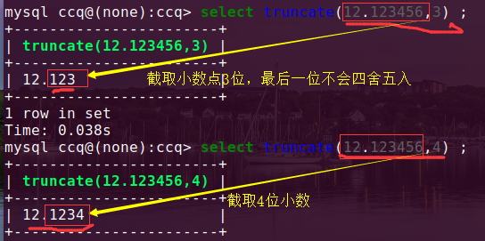

### 数据库查询

#### 一、常见的查询语句

+ **select**  ==>字段表达式

  + `select 字段1，字段2  from  表1,表2`   ==>**查询指定字段**的数据。
  + 例子

  ```
  select id,name from student;    ==> 显示 表 student 中 id,name 字段信息。
  
  select unix_timestamp();  ==>查询当前的时间戳，， 上限2038年1月1日
  
  select rand();  ==>随机数
  ```

+ **from** ==>代表查询的 **数据源**，数据源可以多个，可以是子语句。

  + 注意：如果查询多个表中字段，需要指定  字段所在的表
    + `select  表1.字段1,表2.字段2   from   表1 , 表2  ;`
    + 此时 **表1.字段1 中的每个数据** 都会 **匹配 表2.字段2** 的数据。 相当于下面的图，似**笛卡儿积**
    + 

+ **where**  条件过滤

  + 格式： `select 字段 from 表名 where 条件;`   ==>只返回满足条件的语句
  + **空值判断**
    + 判断语句： `is null | is not null` 还有使用  **<=>**  
  + **范围判断**  `between …… and …… | not between`   ==>双闭区间
    + 比如：`select id,math, from score where math between 60 and 70;`  返回 math  60 到 70 之间。 
  + **模糊搜索**  like 搭配 % 
    + `select * from student where name like '张%';`   ==> 找到name中 姓**张**的name，%

+ **group   by**   分组查询

  + 按照某一字段进行分组，把改字段相同的值划分为一组。（存在where条件条件判断放在where的后面）
    + 格式:`select 字段 from 表名 group by 分组字段`
  + 例子

  ```
  select city,count(city) from student group by city;  ==>利用count聚合函数来计算分组的成员个数。
  select city,group_concat(name)  from student group by city;
  	这里按照city 进行分组，通过group_concet连接了nama字段，此时会显示出分组里面name成员
  
  select sex,avg(math),avg(english) from student group by sex;
  //显示把表student中按照sex 进行分组，利用聚合函数 ，avg 来计算各科男女的平均分
  
  ```

+ **having**

  + having 语句可以和聚合函数一起使用，但是 where 不能和聚合函数一起使用。
  + 格式：`select 字段1 from 表1 having 字段1 条件   `
    + 注意：having 后面用于判断条件的字段，前面必须也要有该字段，否则无效。
    + having  可以放在group by 后面  ，然后where 不可以（where只能放在数据源后面），
  + 例子

  ```
  //使用 where  来筛选数据 , where 后面跟的字段与前面的出现的字段没要求，只要在表里即可
  select name birthday from student where birthday > '1995-1-1';
  
  //使用having  来筛选数据 ， 需要注意 having 后面的字段，前提前面也需要存在该字段。
  select name birthday from student having birthday > '1995-1-1'
  
  //where 和 having 两者混用
  select * from student where id>=3 and city='北京';  ==> 返回id大于3，城市为北京的
  select * from student having id>=3 and city='北京';
  
  select * from student where id>=3 having city='北京'; => 两者混用
  
  配合group by 来使用
  select city group_concet(birthday) from student group by city having min(birthday) > '1995-1-1';
  
  ```

  

+ **order by**    查询结果按照   指定字段 排序  （默认是按照ID）
  
  + `select * from student  order by 字段  `   ==>按照字段进行排序
  
+ 默认的排序是(**asc  升序**)。**倒叙** 在尾部添加  desc;   
  
  + 如果原先就乱序了 （没有用order by）,利用**explain**来查看按什么排序。
  
    + `explain select  id,name from student;` ==> key 为 name按照name排序
  
    + 汉字的排序是按照 unicode编码进行排序的。
  
      在python中，可以查看汉字的unicode编码，
  
      ```
      x =['字',……]
      for c in x：
      	print(c,ord(c))
      ```
  
+ **limit**   限制取出数量 

  + ```
    select 字段1，字段2……  from 表名  limit n;   ==> 这里是从开头取了 n 行数据
    
    select 字段  from 表名  limit m,n ; ==> 前者是跳过，后者是取得数据。从6行开始取3行。
    select 字段  from  表名  limit n offset m  ==> m是跳过，n是取，offset是指的偏移量。 
    ```

+ **distinct**   去重  （去除字段中重复的的数据）

  + `select distinct  city from student ;` ==> 查找字段city的内容，利用 distinct对数据进行去重，，和 单纯的 group by 是一样的，分组也具有去重的功能。   

+ **dual**  表  （是个虚拟表，可以不用写）
  
  + `select now() from dual;`   ==>   函数 now（）显示当前的时间，年月日时分秒。
  
+ **information_schema.columns** ==>显示表的字段名

  + mysql安装成功后可以看到已经存在mysql、information_schema和test这个几个数据库。

    information_schema库中有一个名为COLUMNS的表，这个表中记录了数据库中所有表的字段信息。知道这个表后，获取任意表的字段就只需要一条select语句即可。

  + ```
    Select COLUMN_NAME 列名, DATA_TYPE 字段类型, COLUMN_COMMENT 字段注释  
    from INFORMATION_SCHEMA.COLUMNS  
    Where table_name = 'companies'  ##表名  
    AND table_schema = 'testhuicard'##数据库名  
    AND column_name LIKE 'c_name'   ##字段名  
    ```

  + `select column_name from information_schema.columns where table_name='表名' and table_schema='数据库名'`

  + 

**frozen-bubble  泡泡龙**

### 二、函数

与  同为1==>为1，否则为0

或  有1为1

非 同为0，

#### 1、聚合函数

| 函数名           | 功能                                                         |
| ---------------- | ------------------------------------------------------------ |
| AVG()            | 返回平均值，如`select  avg(字段1) from 表1 ` ==> 返回表1中字段1的平均数 |
| BIT_AND()        | 按位返回AND，`按位与` 计算  ，同为1得1，否则为0.             |
| BIT_OR()         | 按位返回OR, `按位或`  有  1 的时候为1                        |
| BIT_XOR()        | 按位返回异或，同为0                                          |
| COUNT()          | 返回的行数   `select count(city) from v_exam1;`  ==>返回10   |
| count(distinct)  | 返回许多不同值的计数 `select count(distinct city) from v_exam1;`返回4 |
| group_concat()   | 返回连接的字符串                                             |
| json_arrayagg()  | 将结果集作为单个json的  数组  返回                           |
| json_objectagg() | 将结果集作为单个json的  对象  返回                           |
| max()            | 返回最大值                                                   |
| min()            | 最小值                                                       |
| sum()            | 求和                                                         |
| std（）          | 返回标准差                                                   |
| stddev()         |                                                              |
| stddev_pop()     |                                                              |
| stddev_samp()    |                                                              |
| var_pop（）      |                                                              |
| var_samp()       |                                                              |
| variance（）     |                                                              |

+ `JSON_ARRAYAGG(字段)`   ==>  将结果集用json的**数组**返回。
  + 

+ `JSON_OBJECTAGG(字段1,字段2) `  ==>json的**对象形式**返回
  + 

#### 2、数值计算类函数

| 函数           | 对应的功能                              |
| -------------- | --------------------------------------- |
| abs()          | 返回绝对值                              |
| ceil()         | 向上取整    比如 4.0002   == > ceil取 5 |
| floor()        | 向下取整                                |
| round(x,y)     | 指的的数值x，返回指定 y 位 小数         |
| rand()         | 0-1内的随机数                           |
| truncated(x,y) | 指定的数值 x， 对x进行 y 位 截断。      |
| mod(x,y)       | 求模，相当于 X%y                        |

+ `abs()  `返回绝对值
  + 
+ `truncate(x,y)`  ==>对x的小数截取y位
  + 

#### 3、字符串函数

| 函数                   | 对应的功能                                                   |
| ---------------------- | ------------------------------------------------------------ |
| concat(s1,s2,s3)       | 连接 指定参数位 一个字符串                                   |
| insert(str,x,y,instr)  | 把字符串str从位置x开始，y个字符长度 替换为 instr             |
| lower(str)             | 全小写                                                       |
| upper(str)             | 全大写                                                       |
| left（str，x）         | 返回字符str 的  最 左边   x 个  字符                         |
| right（str，x）        | 同理，返回 字符str 的 最右边 x 个字符                        |
| lpad（str，n，pad）    | l指的时left，pad指填充，给字符串str的 左边 填充字符pad，填长度 n 位 |
| rpad（str，n，pad）    | r指的right，给字符串str的右边 填充字符pad，填充长度 n位      |
| ltrim（str）           | 去除字符串 左边空格                                          |
| rtrim（str）           | 去除字符串 右边 空格                                         |
| trim(str)              | 去除两边的空格                                               |
| repeat（str，x）       | 返回字符串str 重复  x 次的效果                               |
| replace（str，a，b）   | 字符串 str 中 a 的字符 用 字符 b 来替换                      |
| strcmp（s1,s2）        | 比较字符串  s1,s2                                            |
| substring（str，x，y） | 返回字符串str 从 位置 x 开始，取y位长度的子串                |

+ `concat(s1,s2)`
  + 

+ `insert()`    ==>可以对 指定的字段  一同添加   指定的数据。
  + 

+ `replace(str,a,b) `  ==> 字符串中a 替换成
  + 
+ `substring(str,x,y)`
  + 

#### 4、日期计算类函数

| 函数                                          | 对应的功能                                                  |
| --------------------------------------------- | ----------------------------------------------------------- |
| curdate()                                     | 返回当前日期                                                |
| curtime()                                     | 返回当前时间                                                |
| now()                                         | 返回当前日期和时间，年月日时分秒                            |
| unix_timestamp(date)                          | 返回指定date的unix时间戳                                    |
| from_unixtime(）                              | 返回unix时间戳的日期值                                      |
| week（date）                                  | 返回该日期date是该年的第几周                                |
| year（date）                                  | 返回该日期date的年份 （month返回月份、day返回当前月份天数） |
| hour（time）                                  | 返回该时间time的的小时值，（minute返回分钟值）              |
| date_format（date，fmt）                      | 返回按照字符串fmt格式化日期date值                           |
| datediff（expr2，expr2）                      | 返回起始时间expr1和expr2之间的天数                          |
| date_add(date,intervalr expr  day/month/year) | 一个日期或时间值 加上一个时间间隔的 的结果                  |

+ `datediff(date1，date2)`   ==>返回两者时间  相差的天数。
  + 

+ `dete_add(date,expr)`  ==> 给日期添加时间值（天数，月份，年份），需要  `interval  expr  day`
  + 

#### 5、其他函数

| 函数           | 功能                     |
| -------------- | ------------------------ |
| datebase()     | 当前数据库的名           |
| version()      | 当前数据库的版本         |
| user()         | 当前登录的用户名         |
| inet_aton(ip)  | ip 地址 用 数字表示      |
| inet_ntoa(num) | 返回  数字代表的 ip 地址 |
| password(str)  | 返回str  的 加密 版本    |
| md5(str)       | 返回str 的 md5  值       |


### 三、多表查询

#### 1、union 联合查询

+ 要求：**两个select的语句**的字段数 必须一样。(返回的结果的**字段名默认按照左边表的字段设置**)

+ 将两张表的 同一字段 的值 **合并**

  `select 字段1,字段2 from 表1  union select 字段1，字段2 from 表2`

  + 注意：上面字段的合并需要 对应号位置 

#### 2、inner join  内连接(交集)      

格式：`select 表1指定字段 from 表1 inner join 表2 on 表1.字段=表2.字段`

+ 比如学生的信息分散到两张表中，利用inner join 进行合并

`select student.id,name,math,english from student inner join score on student.id=score.id ;`

**注意：**如果两张表中有相同的的字段名，那么前面需要指定的表如 student.id，为了减少麻烦，可以直接在数据源 后 利用as 定义别名如 `from student as a`这时表名直接用a代替即可。同样 as 也可以忽略。`from student a` 

#### 3、left  join 左连接

left join 关键字 会 返回 左表 中的所有行，右表中没有匹配的，那么会返回NULL

+ `select l.id,l.name,r.id,r.math,r.english from sudent as l left join score as r on l.id=r.id order by l,id;`
+ 

4、right  join 右连接

+ 同理右连接 和  左连接的 原理一样的。


#### 5、子查询


**练习：对今天的 student 表进行统计查询操作**

1. 找出每个地区数学最高分的学生的姓名

   ```
   
   create view v_exam1 as select sd.id,sd.name,sd.city,sc.math,sc.english from student as
                  sd inner join score as sc on  sc.id=sd.id; 
   
   select v1.city,v1.name,v1.math as max_math from v_exam1 as v1,(select city,max(math) from v_exam1 group by city )as v2 	where v1.math=v2.`max(math)`and v1.city=v2.city ;    
   ```

2. 找出每个地区英语最低分的学生
    与第一题同理

  ```
  
  select v1.city,v1.name,v1.math as min_english from v_exam1 as v1,(select city,min(english) from v_exam1 group by  city )as v2 where v1.english=v2.`min(english)`and v1.city=v2.city ;     
  ```

3. 计算出男生、女生的英语、数学的平均分    男：70.6、48.2    女：70.84 、70.1

    ```
    select new.sex,avg(english),avg(math) from (select student.id,sex,sc.math,sc.english from student inner join score as sc on student.id=sc.id) new  group by sex ;
    
    ```

4. 计算出年龄最大与最小的学生的出生日期相差多少天  1982day

  ```
  select ( unix_timestamp(max(birthday))-unix_timestamp(min(birthday)))/(24*3600) as day
                       from student ;   
  法2直接用datediff： select datediff(max(birthday),min(birthday)) from student;
  ```

  