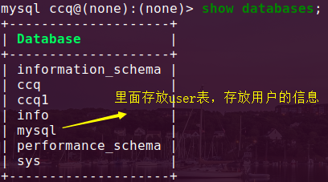
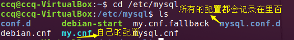
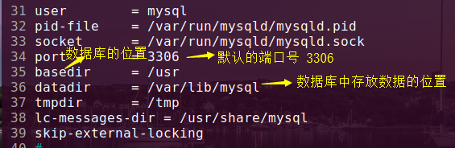
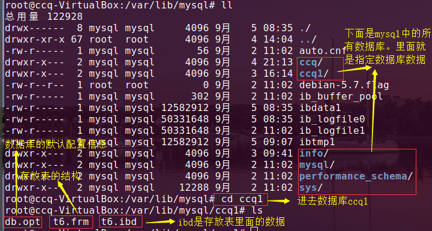
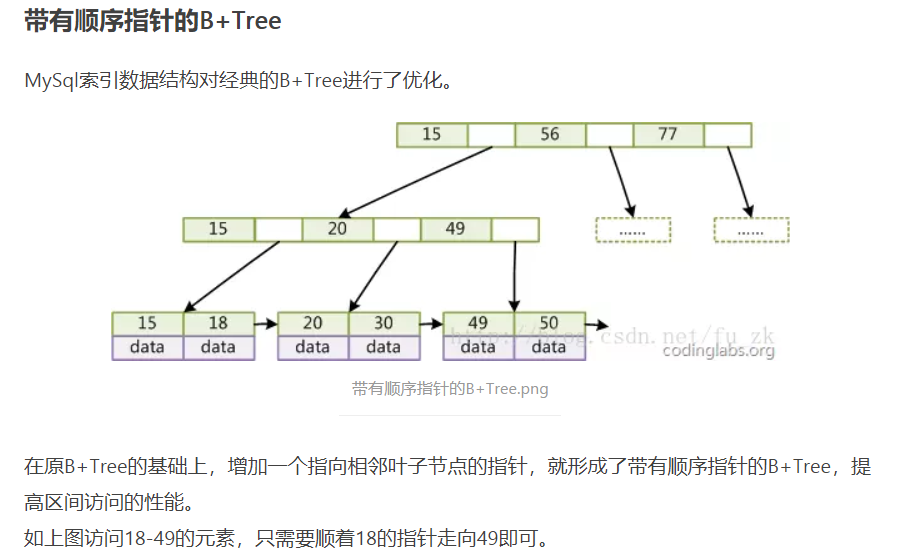
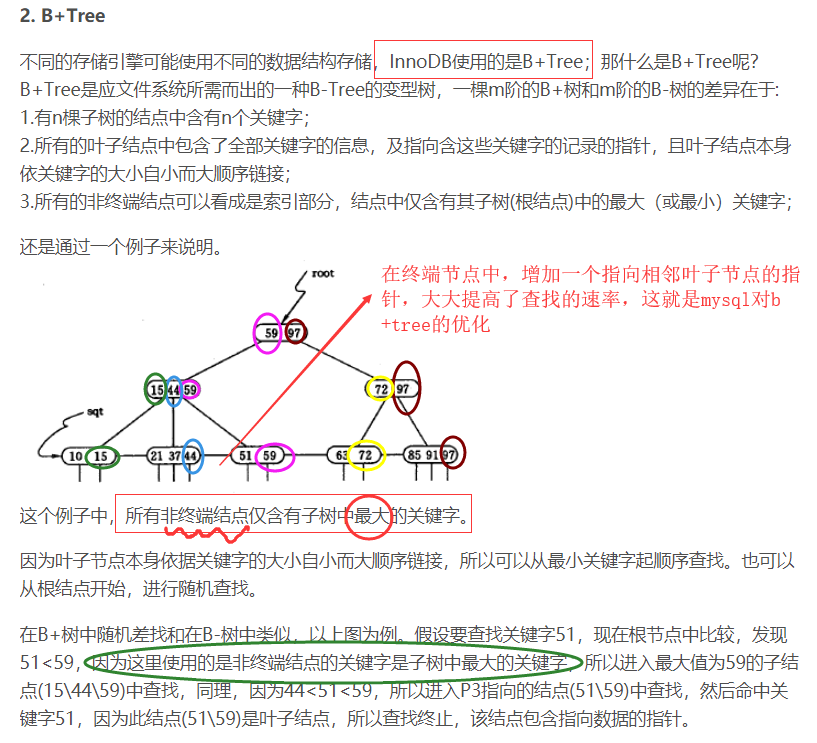
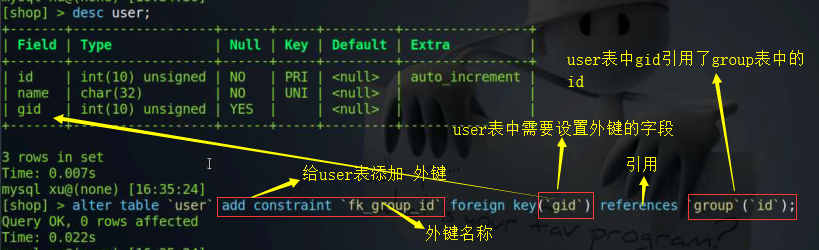

### 数据库的高级特性

### 一、权限管理

+ 第一阶段：连接时的验证。主要限制用户连接，ip、密码
+ 第二阶段：进行一些语句查询等操作的权限。

### 二、权限准则

+ 只授予能满足需要的**最小权限**。防止用户执行危险操作。

+ 限制用户登录的主机，防止不速之客登录数据库。
+ 禁止或删除没有密码的用户
+ 禁止用户使用弱密码
+ 定期清理无效的用户，回收权限。

### 三、常见操作

1、**创建用户，以及权限的授予**

```
GRANT ALL PRIVILEGES on *.* to '⽤户名'@'主机' IDENTIFIED BY "密码" WITH
GRANT OPTION;
flush privileges; -- 刷新使权限⽣效
```

+ All PRIBIVILEGES    ==>这里时设定了全部的操作语句，可以在该位置设置指定的一些操作，如select，create等
+ `*.*  `==>这里时允许操作的所有数据以及首页表。可以指定比如：ccq.*  这只允许操作ccq数据库的所有表  .*  指的时所有表。
+ IDENTIFIED BY  确认并设置密码
+ WITH GRANT OPTION  ==> 指的是第二次访问了，还是原先赋予的权限，二次赋予
+ flush privileges;  ==> 立即生效，因为mysql中也存在着缓存。


+ 查看账号信息    

​	需要进入 mysql  数据库里面 中的 user表

​	

​	user表中一些主要字段信息：


```

user表中右两个主键， 用户和主机  ==> 联合主键

passwd_expired   过期的

last_change   最后一次修改的

lifetime     密码过期时间

accout_locked   账号的锁定  
```

+ 修改密码

`alter user 'root'@'localhost' identified with mysql_native_password by '你的密码';`

+ 查看当前用户权限

`show grants;`

+ 查看指定用户权限

`show grants for '用户名'%'localhost';  `

+ 回收用户的权限

`revoke delete on *.* from '用户'@'localhost';`

+ 删除用户

```
use mysql;
select host,user from user;
drop user 用户名@'%';
```

### 四、视图

实际上就是一种虚拟表，或者临时表

只允许查 ，不可以增删改查。

依赖 查询语句

不会占用数据，不会自己消失，手动删除，不会影响源数据

1、创建视图

+ `create view 视图表名 as 查询语句`

+ 每次操作视图表，照样会执行 查询语句，并不会改善性能，只是单纯的提高操作速率

2、查看 与真实表操作一样

3、删除视图表

`drop view 视图表名;`

### 五、存储引擎

概念：如何存储数据，如何为数据建立索引和如何更新、查询数据等一些方法。

myqll支持多种多种存储引擎，通过选择不同的引擎提高应用的速率

+ 查看当前存储引擎

  + ```
    show variables like '%storage_engine'
    show engines；             查看mysql支持的一些引擎
    ```

+ mysql常用的存储引擎

  + 事物：同一操作一数据，会添加事物，保证数据安全，事物如果你操作到一半失败了，原先的操作是无效的，会还原 前面操作的数据。

```
常用引擎   最大内存(单表)   事物   索引   数索引	哈希索引    数据缓存    外键
myisam    256TB  		 no	   yes   yes		no         no       no
memory    RAM(设备的ram)  no    no    yes		  yes        n/a       no
innodb	  64TB			 yes   no	 yes		yes        yes      yes
```

#### 1、`innodb`引擎

##### 事务的了解

+ 事务型数据库的首选引擎。支持事物安全表(ACID)，支持行锁定和外键，该引擎是默认的mysql引擎。(后面详细)
  + **ACID**指的是数据库事务执行的4个基本要素。A--原子性、C--一致性、I--隔离性、D--持久性；分别指的是：
    + **原子性** ==> 整个事务的操作要么全部完成，要么全部不完成，不会停滞在中间的某个环节。如果在执行的过程中出现错误，会被 **回滚(rollback) 到事务开始前的状态**，就像该事物没有执行 一样。
    + **一致性** ==> 一个事务可以封装状态改变(除非它只是一个只读的)，事务必须始终保持系统处于一致的状态，不管在任何给定时间并发事务有多少。
    + **隔离性** ==> 如果多个事务运行在相同的时间中，并且执行相同的功能，那么事务的隔离性会确保每每一个事务在系统中认为只有该事物在使用系统。
    + **持久性** ==> 在事务完成后，该事务对数据库所作的更改 会 持久的保存在数据库中，并不会回滚。
  + 一**个数据在多个并发下产生的一些问题**？ 
    + 数据**读取问题**
      + 脏读  ==  >  事务a 读取了 事务b**未提交**的数据，并且还在该基础进行操作。
      + 不可重复度 ==>  事务a 读取了 事务 b 已经提交**修改**的数据。
      + 幻读  ==>   事务a 读取 事务b  已经提交的**新增**的数据。
    + 数据**更新问题**
      + 第一类丢失 ==>  事务a在执行过程中，此时事务b对数据已完成更新，然后事务a 撤销了，那么会把已经提交的事务b更新数据覆盖。
      + 第二类丢失  == >  事务a开始执行，中途事务b也执行，然后事务a 提交事务操作完成，之后事务b在继续操作，这时事务b覆盖了事务a提交的数据，事务a的操作丢失。
  + 事务的隔离级别：读取未提交、读提交、可重复读、串行化、（级别越来越高）
  + mysql数据库中默认的事务隔离级别就是：read_committed(读提交)，
  + 
  
+ 自带缓冲池，可以把数据和索引缓存在内存中。
+ 支持外键完整性约束。
+ 支持**行级锁、表锁**。

#### 2、myisam

+ 在web、数据仓储、和其他应用环境下最常用的存储引擎之一。拥**有 较高的插入、查询速度**，但是不支持事物。
  + 大文件支持更好。
  + 在删除、更新、插入混用时，产生更少的碎片。
  + blob和text列可以被索引。
  + 只支持**表锁**。

#### 3、memory

+ 将表中的数据**存储到内存中**，为**查询和引用**其他表数据提供**快速访问**
  + memory存储引擎执行**HASH和BTREE索引**
  + 表在所有**客户端之间共享**   （临时表存在内存当中）

#### 4、如何选择引擎

+ 写入性能 ==> innodb

+ 取数据，大量的数据 ==> myisam

+ innodb：如果想要提供提交、回滚、崩溃恢复能力的事务安全（ACID兼容）能力，并实现并发控制

+ myisam：**如果数据表主要用来插入和查询记录**，则此引擎效率快

+ memory：如果只是临时存放数据，数据量不大，并且不需要较高的数据安全性，可以选择将数据保存

  在内存中的memory引擎，MySQL中使用该引擎作为临时表，存放查询的中间结果

+ Archive：如果只有insert和select操作，可以选择此引擎。Archive支持高并发的插入操作，但本身并不是事务安全的。Archive非常适合存储归档数据，如记录日志信息。

#### 5、使用引擎(建表时添加) 

+ **engine**

```
create table abc (
	字段
) engine=myisam charset=utf8;

create table xxx(
	字段 类型 属性
) engine=innodb charse=utf8;
```

#### 6、主从复制-读写分离

+ 主从复制 ==>当查询、处理大量的数据，一个主机扛不住的，主机的操作记录(增删改查)会保存在bin_log文件。从机会读取该文件，从机也执行一样的操作，这样才可以实现 主从复制，一台主机，多台从机，从机与主机的行为是一样的。
+ 读写分离  ==>写入的话一般是在主机上操作， 读取数据 从机操作，（这样用户进行读取数据，会向从机读取，多台从机，读取的数据也会加快）
+ 当你大量写入数据，同步日志时，会另外来一台机器，blackhole 黑洞引擎(会保留日志，从机从这里来获取)，来缓解主机读写的压力。

#### 7、innodb 和 myisam 的文件区别

mysql的默认配置  cd /etc/mysql   全部记录在 mysql.conf.d 里面的文件 **mysqld.cnf**



该配置的主要信息：



数据的位置默认在：`/var/lib/mysql`

​	

​	

`innodb `中一张表有**两个文件**：(如上图所示，该表是用innodb引擎，表分为两个文件)

​			frm ==> frame  存放的是表结构

​			ibd  ==> 存放的是表里面数据

​	`myisam` 中一张有**三个文件**：

​			frm 表结构

​			myd 记录表里面数据

​			myi  记录表的是索引

### 六、索引

索引就是为特定的mysql字段进行一些特定的算法排序。  折半查找O(logn) 比如查找1000000条数据，中的一条，根据复杂度，可以知道以2为底，1000000，可以得到llog2(1000000)=>20次，最多找20次。

mysql中默认的**索引结构**   ==>   b+tree（b 树）进行了优化（log2(N)）





**memory 中存在hash表**，它只能存在内存中。hash表也是散列表（时间复杂度o1）

+ 索引优点：快
+ 缺点：额外的使用了一些存储的空间
  + 会让操作变慢

**创建索引原则**：频繁查找的列、经常用于条件判断的列，经常用于排序的列。

​			主键自带索引，利用unique的唯一字段也会自带索引（且为唯一索引）

+ 创建索引

```
1、建表是添加索引
create table 表名(
	id int not null,
	username varchar(16) not null,
	index 索引名(字段名(长度))
);


2、后期添加索引    inidex 名 on 表(指定字段添加索引)
create index 索引名 on student(字段(长度));  ==> 其中长度指的是该字段的字符长度
```

+ 删除索引

`drop index 索引名 on 表名`

+ 唯一索引

```
create unique index 索引名 on 表(字段名(长度));
或
create table 表(
	id int not null,
	username varchar(16) not null,
	unique 索引名(字段名(长度))
);
```

+ 查看索引

`show index from 表名`

+ 全文索引
  + 适用与很长的文本，比如text类型，全文索引 存在与  myisam  引擎当中

### 七、关系与外键 

+ 1:1
  + 比如：其中 表1 中的id 与  表2 中的id 存在一一对应的关系   
+ 1:n
  + 在 表1 中有一条记录，在 表2 中有  多条记录  对应
+ n:m
  + 表1 中 一条记录在 表 2 有多条记录对应，同样表2中一条数据在表1 也有多条对应                               

#### 2、外键

是一种约束，保证数据的完整性。会降低性能(由于外键的存在当你每次插入数据时、修改，外键进行约束检查，不满足不让插入修改。如果数据很大的话，你要插入修改的话，要去检查满不满足，这是很耗性能的)

```                                  
比如：--用户表
create table user (
	id int unsigned primary key auto_increment,
	name char(32) not null unique
) charset=utf8;
--用户信息表
create table userinfo(
	id int unsigned primary key auto_increment,
	name char(32) not null unique,
	price float
)charset=utf8;
//建立外键为user和userinfo建立关联
alter table userinfo add constraint fk_user_id foreign key(id) references user(id);

添加外键同样是修改 alter table 表名、添加外键 add constraint 后面可以起个别名。  foreign key(字段)  ==> 添加外键的字段 ， references 表(字段) ==> 前者创建的外键 与 后面的表进行关联，并指定关联的字段。
```



外键约束：想要删除主表的数据，需要先删除子表(添加外键的表)的数据，

外键只存在于innodb中，如果在其它引擎也可以创建，但是没有效果。