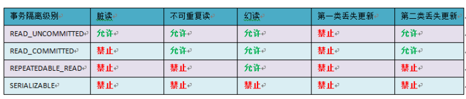
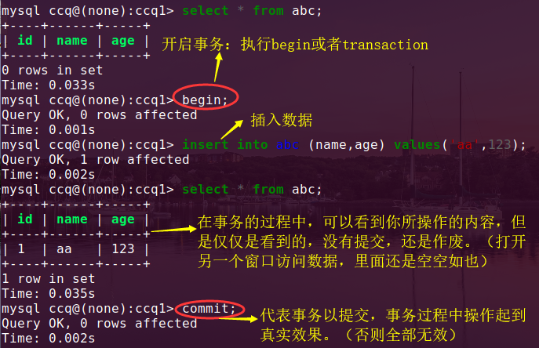
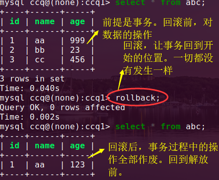
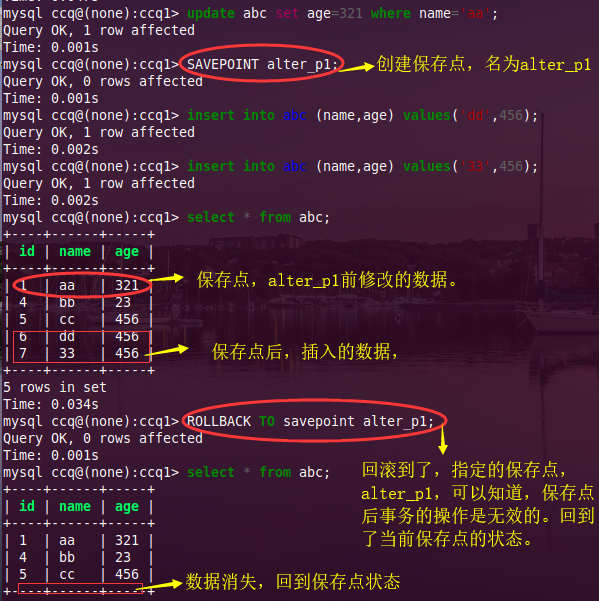

### 事 务

处理操作量，复杂度高，关联性强。

**事务型数据库的首选引擎**。支持事物安全表(ACID)，支持行锁定和外键，该引擎是默认的mysql引擎。

- **ACID**指的是数据库事务执行的4个基本要素。A--原子性、C--一致性、I--隔离性、D--持久性；分别指的是：
  - **原子性** ==> 整个事务的操作要么全部完成，要么全部不完成，不会停滞在中间的某个环节。如果在执行的过程中出现错误，会被 **回滚(rollback) 到事务开始前的状态**，就像该事物没有执行 一样。
  - **一致性** ==> 一个事务可以封装状态改变(除非它只是一个只读的)，事务必须始终保持系统处于一致的状态，不管在任何给定时间并发事务有多少。
  - **隔离性** ==> 如果多个事务运行在相同的时间中，并且执行相同的功能，那么事务的隔离性会确保每每一个事务在系统中认为只有该事物在使用系统。
  - **持久性** ==> 在事务完成后，该事务对数据库所作的更改 会 持久的保存在数据库中，并不会回滚。
- 一**个数据在多个并发下产生的一些问题**？ 
  - 数据**读取问题**
    - 脏读  ==  >  事务a 读取了 事务b**未提交**的数据，并且还在该基础进行操作。
    - 不可重复度 ==>  事务a 读取了 事务 b 已经提交**修改**的数据。
    - 幻读  ==>   事务a 读取 事务b  已经提交的**新增**的数据。
  - 数据**更新问题**
    - 第一类丢失 ==>  事务a在执行过程中，此时事务b对数据已完成更新，然后事务a 撤销了，那么会把已经提交的事务b更新数据覆盖。
    - 第二类丢失  == >  事务a开始执行，中途事务b也执行，然后事务a 提交事务操作完成，之后事务b在继续操作，这时事务b覆盖了事务a提交的数据，事务a的操作丢失。
- 事务的隔离级别：读取未提交、读提交、可重复读、串行化、（级别越来越高）
- mysql数据库中默认的事务隔离级别就是：read_committed(读提交)，



### 语法与使用

+ 开启事务：begin或start  transaction
  + 
+ 提交事务：commit
+ 回滚：rollback
  + 
+ 创建保存点：`savepoint 保存点名称`
+ 删除保存点：`release savepoint identifier`
+ 把事务回滚到保存点：`rollback to  savepoint identifier`
  + 注意：事务可以创建多个保存点。可以回滚到指定保存点的位置。如果跳级的回滚，那么该级以下的保存点，会作废，提示你不存在。
  + 
+ 创建隔离点：`set session transaction isolation level 隔离级别`
  + 设置隔离级别==> `set session transaction isolation level read uncommitted`
    + 事务隔离的级别
      + read uncommitted   -->  未提交读（出现脏读(事务a中操作数据没提交，事务b却能读取到 事务a操作的数据)）
      + read  committed  --> 已提交读（解决脏读，出现来了不可重复读问题，）当前默认级别的。
      + repeatable read  -->幻读（可重复读，假如事务a开启，事务b更改数据，没有提交，事务a是读取不到，事务b提交之后，事务a依旧读取不到(但在读提交级别的是读得到b中提交的数据)，这就是所谓的幻读。把事务a提交了，读取就正常了）
      + serializable  -->可串行化（如果事务a设置的该级别，那么事务b操作统一数据会进入等待状态，因为事务a 的没有提交，只能等待(可能超时)，当a提交之后，b的事务就可以操作了。）

事务在未提交前，执行的操作都是临时的，并不会真正的对数据库造成修改。(当你在事务中查询select的结果是和在外部看的表的状态是不一样的。)

```
 create table abc ( 
                       id int unsigned primary key auto_increment, 
                       name varchar(32) unique, 
                       age int unsigned 
                       ) character set=utf8; 
```

### 锁

锁是计算机协调多个进程或线程并发访问某一资源的机制。是mysql在服务器层和存储引擎层的并发控制。

保证数据并发访问的一致性、有效性；

锁冲突：也是影响数据库并发访问性能的一个重要因素。

#### 分类

+ **行级锁**
  + 是mysql中锁定粒度**最细**的一种锁，只针对当前操作的 **行** 进行加锁。
  + 只有innodb引擎支持。
  + 大大减少数据库操作的冲突。锁的粒度最小，同时锁的开销也是最大。
  + 特点：开销大，加锁速度慢。会出现死锁；锁的粒度最小，那么发生锁冲突的概率也是最低，并发的程度的也最高。
+ **表级锁**
  + 是MySQL中粒度最大的一种锁
+ 共享锁（读锁）
  + 其它事务不能修改，但是可以读取数据
+ 排他锁（写锁）
  + 事务T 对数据A  加上排他锁，则其它事务不能给数据 A 添加任何类型的锁。
+ 乐观锁（Optimistic lock）
+ 悲观锁 （Pessimistic lock）


### 存储过程

注意：只能在mysql中使用，不能 在mycli中，因为mycli不会对//进行解释

对sql语言层面的代码封装与重用

1、优点

+ 存储过程可封装，
+ 无法使用select 指令

2、缺点

+ 

触发器（是特殊的存储过程）

3、语法

```
delimiter //    ==> 因为定义// 可以让下面的看做是一句话，里面的；号不会起结束语句的作用，只是单独 分隔。然后写完语句之后，在用 end//  delimiter ; ==>还原 ; 号
create procedure show_student(in uid int)
begin
select * from student where id=uid;
update student set city="模式库" where id =uid;
select * from student where id=uid;
end //
delimiter ;

这里就算是定义完成了
call show_student(3)
```


### python 操作

1、安装`pip install pymysql`

2、使用

 execute(sql,(……))  ==> 参数2是个元组，参数1是sql语句的模版，execute会对这两个参数拼接，把参数2 的内容拼在 模版上指定的占位的位置

```
import pymysql
db = pymysql.connect(host='localhost',
                    user='user',
                    password='passwd',
                    db='db',
                    charset='utf8')
try:
	with db.cursor() as cursor:
		# 插⼊
		sql = "INSERT INTO `users` (`email`, `password`) VALUES (%s, %s)"
		cursor.execute(sql, ('webmaster@python.org', 'very-secret'))
	# 需要⼿动提交才会执⾏
	db.commit()
	with db.cursor() as cursor:
        # 读取记录
        sql = "SELECT `id`, `password` FROM `users` WHERE `email`=%s"
        cursor.execute(sql, ('webmaster@python.org',))
        result = cursor.fetchone()
        print(result)
finally:
	db.close() 
```

3、备份（3-4点）

`mysqldump -h localhost -u 用户名 -p 密码 dbname > 数据库名`

4、恢复 （存在的lock 写入锁，）

`mysql -h localhost  -u 用户名 -p  dbname < ./备份文件`

