### Redis与MongoDB

nosql数据库有以下：

按列存取数据库   ==>  HBase、

文档类型数据库  ==> Mongodb、ElasticSearch（搜索用的）存的json文档

键值对数据库  ==> leveldb只能做缓存，Redis、Dynamodb 快速搜索，

### 1、Redis

经常做缓存，因为在执行程序的过程，将数据保存到内存中。读写性能极高。


2、安装Redis

`sudo apt install -s redis`==>-s只是尝试，并没有真正安装。

建议从官方redis.io上找，复制官网下载链接，`wget 链接`

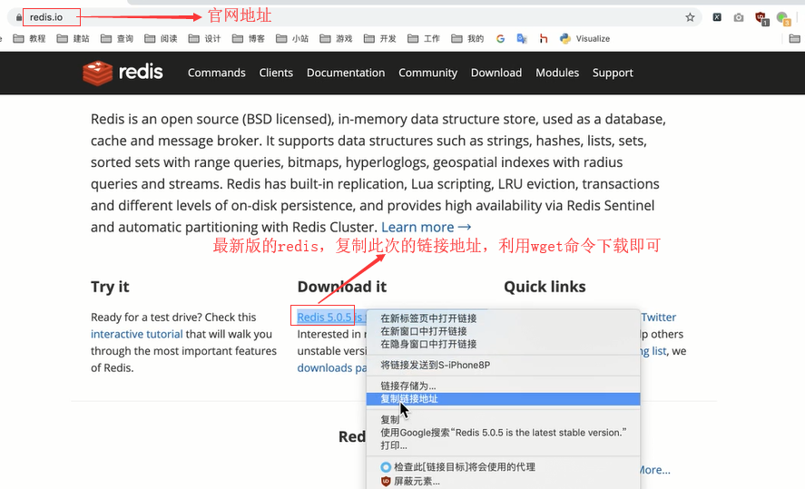

执行下载命令，如下图：

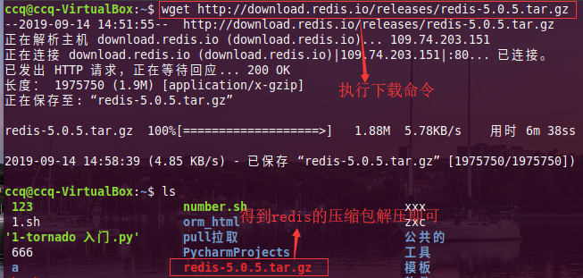


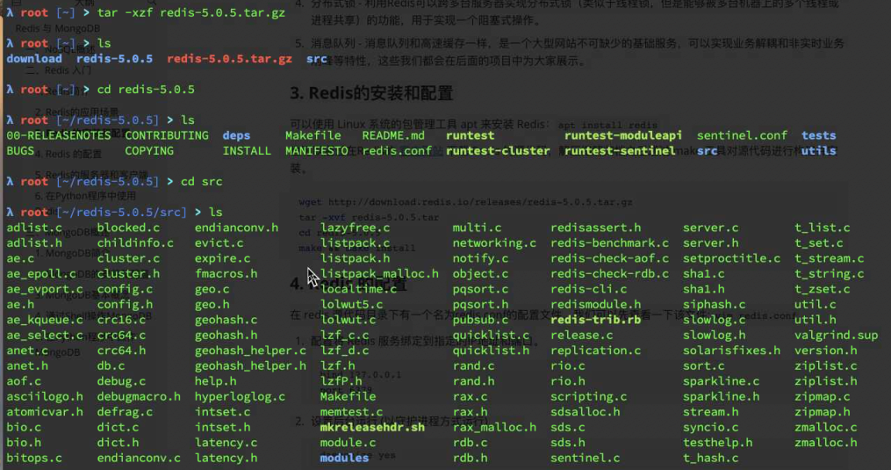

在src目录下有个**Makefile**  自动编译的脚本

+ 直接执行 make 命令，自动编译，然后sudo make install在安装。会得到一个二进制文件，该文件就可以执行了。
+ 或	`make && sudo make install`   ==>一步完成，过程有点不快

安装完成：在/usr/local/bin中

3、运行

​	配置：源代码包(压缩的包)里面  打开 redis.conf			daemonize  no  改成 yes 守护进程开启

loglevel 日志基本 把notce ==》 warning 改成警告


databases  16  ==>默认数据库数量，编号


是否启动的时候显示logo


save 900 1  ==>900s内发生1个键改变，就保存一次

save 300 10   ==> 300s内10个键

save 60  10000  ==>同理


数据库文件  dump.rdb

dbfilename dump.rdb    ==> 这是所有数据的保存的文件。

​	比如：一个dump.rdb 大小大于一个电脑的运行，那么该电脑都不会运行redis，内存太小


dir  ./    ==> 改成 随便  比如 dir  /home/


保存配置文件redis.conf

​	`cp redis.conf   /usr/local/etc`


运行，并给定一个配置文件

`sudo redis-server  /usr/local/etc/redis.conf`

​	

如何使用：调用里面各种各样的命令

redis-cli  回车即可，一般情况下不用设定用户名密码，

命令：set 命令

比如： 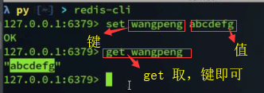


支持位图数据类型，bitmap 数据极快

redis.doc.com  参考说明


可以把数据库的数据取来，放给redis缓存，

比如字符串类型，

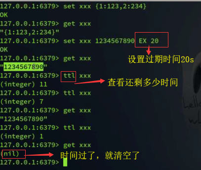


哈希类型s

hset  xxx   a 123 b 456 c 789   ==》 创了一个字典xxx，对应的键a、b、c后面是对应的值

取值： hset xxx  b   ==> 得到456

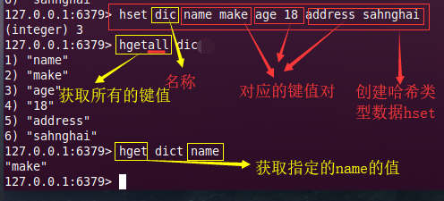

列表,

LPUSH指的是从左边插入

RPUSH 从右边插入 

​	`LPUSH mm l` 名为mm的列表 ，后面指的是插的值

查看：`LRANGE mm  0  -1`   ==>查看全部 0,-1

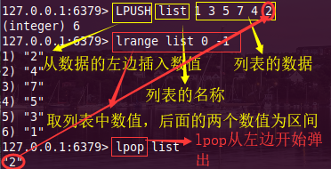

删除： 左弹出  lpop，右弹出 rpop  值

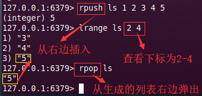

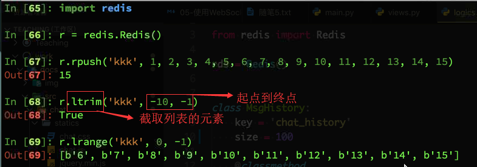

集合 sadd

取交集： SINTER  sss  fff

取并集：SUNION  sss  fff

取差集：第一个对第二个的差集，sdiff

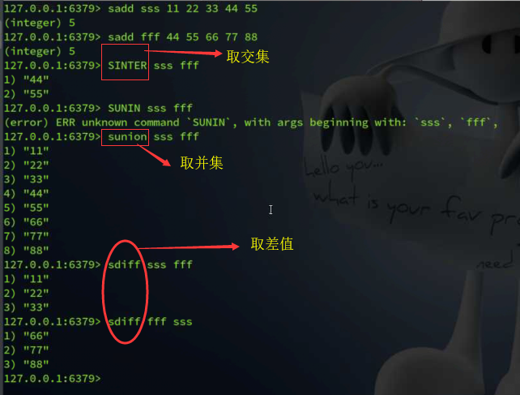


有序集合：zadd  ，先值在键 ，

非常适合排行榜

**zincrby**   ==>插值 

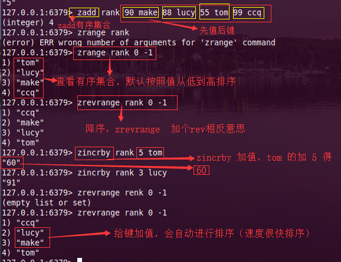

### python中redis

在python中利用模块redis 关联 redis数据库

操作与终端是一样的，首先得到，redis中的键，

```
import redis

r = redis.Redis()

r.keys()   ==>这得到在redis中的键
和在终端的运行差不多的。


```

### mongodb

爬虫阶段，由于数据的不规范，

背后有个公司在支持，以前是个开源的。

安装完 mongodb之后，默认端口号27017


在python中需要安装pymongo，

pip install pymongo

```
from pymongo import Mongoclient

cli = pymongo.

```

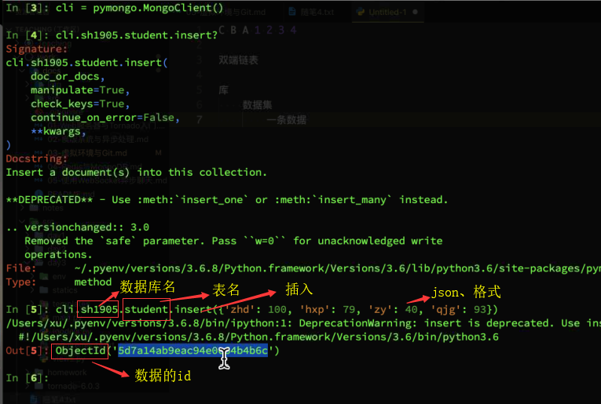

其中：键的值可以是列表。insert可以使用insert_one、

查询：find()   ==>默认查询全部，是个可迭代的，需要使用for

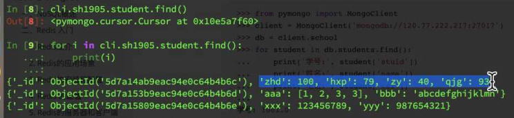

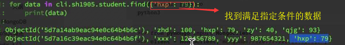

