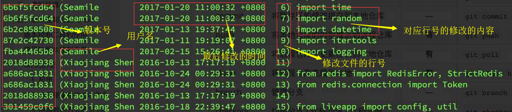

### 一、MVC网站架构

高内聚 低耦合--对外的接口都是统一的，内部互相调用，调用接口，不会影响内部逻辑等

MVC模式：一种架构模式，三个基本成分

+ model 模型==>指的是数据模型
+ view 视图        ==> 用于展示数据，包括（python中：比如一些视图类、模版，写界面的）
+ controller 控制  ==>  主程序，连接model与view层

### 二、虚拟环境

为不同的项目单独设置它运行所需要的环境，这就是需要借助虚拟环境管理。依赖库的问题

pip freeze   查看包的版本

pip list | grep tornado   ==>查看该包的版本

pip install tornado == 5.0   ==>安装指定的版本，那么原先的安装的版本会被卸载

让多个版本的包在系统共存。局部范围内安装，达到不同的程序需要不同的版本。解决兼容问题。

在每个项目中安装虚拟环境。（环境之间是隔离的）

1、安装

+ `pip install virtualenv`

+ 装完之后，就可以用 命令 virtualenv

+ `virtualenv env`  ==>创建了env 文件夹，该env就是虚拟环境。

+ 激活

  + `source env/bin/activate`    ==>前面有个env标记

    

  + 直接就可以使用 pip 进行安装包，都放在这个虚拟环境里面，

在虚拟环境中自成了一个小系统。

2、退出虚拟环境

+ `deactivate`

3、别人用你的程序时，如何做？

+ 把软件的中用的包的版本列出来
  + pip  freeze
  + 
  + 然后重定向到文件中
    + pip freeze  > requirements.txt   ==>写到这个文件
  + 其他客户就在自己的环境下，配置虚拟环境，
    + pip install -r  requirements.txt    ==> -r  把txt文件的中的所有包都安装到虚拟环境中，注意的是： 利用-r 安装文件里的包，需要有版本号

### 三、版本控制工具和Git

git---管理代码：比如 代码功能增多，代码量越来越来，项目由多个人开发，每个人开发的功能都不一样，但是都是围绕一个项目操作的，最终都是要将功能整合到一起。

#### 1、版本控制工具

**作用**：追踪全部代码的状态、能够对比不同版本之间的代码差异、能够进行版本回滚、能够协助多个开发者代码合并。

+ cvs：基本退出了历史舞台
  + 非常早出现的，爷爷级别
+ svn：中心化的版本控制的工具
  + 中心化 ==> 指的是所有的代码操作围绕一个中心服务器。多个开发者是通过中心来看别人的代码的。
+ git：分布式的版本控制工具
  + 典型的分布式 --->不在依赖一个中心了，照样可以有一个公共服务器，。如果没有中心服务器，开发者之间还是可以互相发送补丁，依然可以相互协作。即便就自己一个人，照样可以达到该功能。

#### 2、git

git是linux的创始人开发的，闭关2周开出来的。芬兰的大牛

github代码托管网站

+ hg ： 纯python开发的版本控制工具（汞）
+ github：依托git而创建的一个平台，还有一些 gitlab、codeing  国内：码云

##### git步骤 

+ 1、前提需要导入 git包
  + `sudo apt install git `
+ 2、设置git 的用户名和账号
  + `git config --global user.name '用户名'`==>和github用户名一样
  + `git config --global user.email '邮箱账号' `==>和github邮箱一样
+ 3、进入指定的目录(需要建仓库的文件夹)
+ 4、创建 .gitignore 文件，存放git忽略的文件夹及文件
  + `touch .gitignore`
  + `vim .gitignore ` ==>比如输入内容 env/ 指仓库会忽略该文件夹
+ 5、初始化git状态
  + `git init`    ==>会在当文件夹多个 .git 仓库文件
+ 6、追踪文件
  + `git add  文件名` 或者 `git add ./`  ==>不会追踪 gitignore里面指定文件
  + 撤销追踪
    + `git -reset 文件名`
    + `git rm --cached 文件名 ` =>和 -reset一样道理，只是撤销了暂存区文件
    + `git rm -f 文件名 `  ==> 会直接把本地的都删了
+ 7、查看状态
  + `get status`  ==> 可以看到文件是否被追踪（是否在暂存区）
+ 8、提交记录（提交暂存区文件）
  + `get commit -m '注释'`  ==>添加些此次提交都修改了些啥
  + 查看提交历史记录
    + `git log`
+ 9、在github上创建库，进入一个页面，选择ssh协议。下面是选择了ssh协议，同样也可以选择https协议，只是需要登录。
  + 
  + 首先在github中创建仓库，
  + github上操作： 仓库的名称不能重名，对项目的描述（option可选的）、Public公开与Private私有（查看的权限），如果正在导入仓库的话，下面三个都不用选择（在本地创建就不用选择。第一个是readme，描述的一些信息如何读，导入等，一般都是markdown格式；第二个：是add.gitignore，因为我们在本地执行过这些命令，那就不用选;第三个：版权的协议，需要选择none，否则我们本地的仓库无法上交的。）
+  利用 `diff `来查看文件的差异
  + `git diff 版本号1  版本号2`
    `git diff HEAD^ HEAD   ` ==> HEAD表示最新一个版本，^ 上一个版本号，以此类推^^
  + 查看已暂存修改和未暂存修改
    + 未暂存修改
      + `git diff`
+ 还有一些克隆、其他用户的拉取仓库，即更新。详见下面的例子：

```
首先apt install git 

git里面有很多的命令
比如：clone 克隆，init初始化、reset重置head的状态
帮助文档： git help 命令
 
设置git的用户名和账号  (和github用户名账号)
git config --global user.name 'chen12356'
git config --global user.email '1406159466@qq.com'

cd 到项目文件夹

存在虚拟环境，那么可以使用git 忽略它
那么可以： 
touch .gitignore
vim gitignore  -->编辑  env/    ->那么会忽略giant文件夹

git init  ==>初始化，会出现一个仓库
ls -A  ==> 可以看到多出来了 .git 文件夹。里面就是本地仓库

git status  ==>查看下当前git库的状态。

如何追踪文件，比如
git add view.py  ==>view.py 

git add ./   ==> （把这些文件放到扎暂存区）追踪当前文件夹下的所有文件，忽略除外，

__pycache__ ==> 后缀有prc文件，因为这些是相当于缓存的东西，二进制文件
那么让git忽略该文件
即 vim .gitignore 中加入该文件名

那么之前就已经追踪了__pycache__咱办？
使用 git -reset __pycache__   ==> -reset 取消了暂存区的状态


现在上面的操作并没有提交

git commit -m '项目第一个版本'   ==>提交暂存区的数据 ， m指的是message，添加注释
得到的结果，中 如 100644  => 644 指的是权限

get status  ==>提交完了之后，五文件提交，干净的工作区，

提交的文件在哪呢？提交的文件在本地会创建一个.git 的文件夹里面 以上的操作都是在本地操作
查看提交的历史 git log  会有提交的一些用户实现信息。最上面一行的一大串 是提交的id。用来标记这一次的提交。本地的提交，其他人看不到的

如何发布呢？那么需要和github关联了，把本地仓库导入到github
在github中创建新仓库 
github上操作： 仓库的名称不能重名，对项目的描述（option可选的）、Public公开与Private私有（查看的权限），如果正在导入仓库的话，下面三个都不用选择（在本地创建就不用选择。第一个是readme，描述的一些信息如何读，导入等，一般都是markdown格式；第二个：是add.gitignore，因为我们在本地执行过这些命令，那就不用选;第三个：版权的协议，需要选择none，否则我们本地的仓库无法上交的。）

创建完，选择使用SSH，复制该git命令，在终端输入，这是在本地仓库中添加了一个配置，告诉了本地的仓库我要和远程的哪个仓库接应。

在执行：get push -u origin master ==>push把本地推送到远程取，-u给一个上游的残酷名称（远程仓库的名称默认origin），master 指的分支，
返回一个认证的信息，认证远程服务器对还不对，使用了ssh协议，选择yes

告诉我没有权限，解决办法：那么使用ssh协议，定一个密钥
那么使用ssh 来远程验证,
ssh -keygen     ==>在~/.ssh目录下生成一对的公钥和密钥
提示保存的路径，输入密码，确认密码，啥都不用敲，直接回车
cd ~/.ssh 进入该目录，会有两个文件，id_rsa 密钥，id_rsa.pub 公钥，两个是一对出现的。
在这里我们要把公钥公布出去。复制公钥 ==> 打开 github右上角有个小图标点击settings，点击SSH and GPG keys ==> 点击New ssh key ，把刚才复制的公钥战体在key框中，可以起个名字。然后重新登录。

这会在执行：git push -u origin master 就开始推送了。完成之后，上github可以看到你的个仓库就有推送的内容了。


现在如何把远程的仓库，发送到主机（下载的话只是最新的的）
点击clone or download，如果你使用ssh是不用密码的。比较安全，把框里面的连接复制下来。
在命令行中，直接粘贴即可，这是当前目录就有一个和远程一样的仓库了。

```


```
现在，我本地的开发中，又添加了一些文件，那么这些文件，提交到仓库中
同样：
git add init.py  
git commit -m '增加了数据库初始化程序'
这时本地提交了，但是远程还没有，需要：
git push  ==>远程有那个分支了 ，这里就直接push就可以了。

如何让其他用户也有刚才更新的文件。
执行：get pull  ==> 会拉取远程仓库的中更新的内容(也就是本地没有的)，对比的是本地的提交和远程服务的那个提交记录对比。
其中 get clone ==>会把整个远程的仓库都拉取下来。一般执行一次就好了，后面的更新，直接使用get pull 就可以。
```

### **四、分支管理**

 问题： 比如两个修改同一文件，开发者a对文件进行修改，然后push 推送。开发者b也在维护这个文，同时在修改，开发者a已经推送，这时候开发者b推送不了。因为开发者a已经把仓库更新了，这对于开发者b来说，b的数据已经旧了。这时开发者b需要重新pull

更新自己本地的仓库。 

合并 ==> 开发者b和b重新下载的最新的版本，然后在提交。 在开发者b中 git log -graph 就可以查看到两条线，在中间的位置出现了分支，最终有合并到一起。

如果两者修改的内容了都是一样的，那么git只是保存一份。

+ checkout

代码回滚/代码还原

查看 get log 历史提交记录

回到指定的提交点，每个提交都有提交的id，复制你需要回滚的指定提交点ID号

执行：`git checkout  提交id号`  ==>仓库回退到了 提交id是的状态。

代码的回退，之后还是可以回去的

`git checkout master ` ==>又回到了主干分支，回到最新的状态

- 如果做了错误的修改，，可以使用git diff 查看修改了啥内容

需要：如果把修改的一键撤销呢？

`git checkout 文件名`  ==> 此时修改的文件，就还原到了，修改前状态

注意：如果文件已经 放到了暂存区，是不能还原的。需要利用reset 把文件退出暂存区，然后在 checkout 文件名 即可。

+ blame 

blame   检查每行代码最后一次是谁修改的。

`git blame 文件名 `



+ 冲突与解决冲突
  + 多个开发者同时修改同一位置，并且同一行数据，比如a提交并且push推送。
  + 但是两者改的数据的同一行的，b提交成功，但是b是push推送不了的，开发者b使用pull把冲突的文件拉取下来。 
  + git status 找到冲突的文件，状态 both modified。
  +   逐一打开冲突文件，逐行解决冲突。
  + 冲突解决后，将代码中冲突的标记删除。
  + 放到暂存区，提交，并且push推送。

+ 分支

  + 公司的人数过多，需要提交代码，这样如果就一个分支的话，那么就乱套了
  + 公司中有稳定版，测试版（测试版是基于稳定版继续开发的一些功能）、可能很多开发中的人员，都在测试版 之后继续开发功能 （开发版--基于测试版基础继续开发）

  
  +  分支是在开发中，每个开发者有自己的一个分支（互不干扰），待开发者的的功能都完成了，在将这些分支合并在一起

  + 1、创建分支  branch

    + `git  branch  分支名    `   ==> 创建
    + `git checkout  分支名`   ==> 切换
    + 
    + `git checkout -b  friend `  ==> 加个参数-b，判断分支在不在，不在则创建分支。

  + 2、此时每个开发者就在自己的分支下面对代码进行操作了。

    + 各开发者 在推送时，需要设置上游的 分支中
      + `git push -u origin 分支名` 
    + 成功推送后，对原master分支是不会有影响的，

  + 3、合并分支  merge

    + ```
      //这是最新更新的版本
      git checkout master  ==>先切换到主干
      git merge follow   ==> 利用 merge ，把follow合并到 当前分支
      git push
      
      //现在 开发者2 进行合并，注意：需要先把pull拉取最新的版本
      git pull
      git checkout master
      git merge 分支名
      git push
      如果开发者之间，对同一文件进行修改后，合并时发生冲突，需要先解决冲突。
      ```

    + 注意：

  组织：github.com/sh1905

