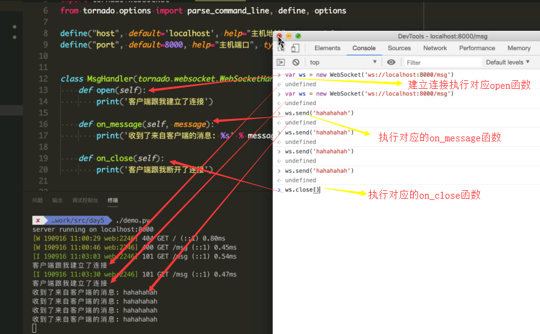
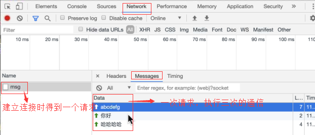
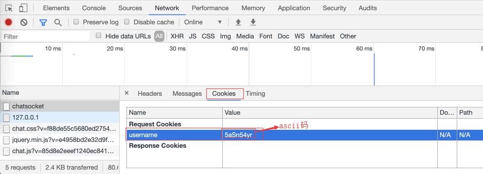
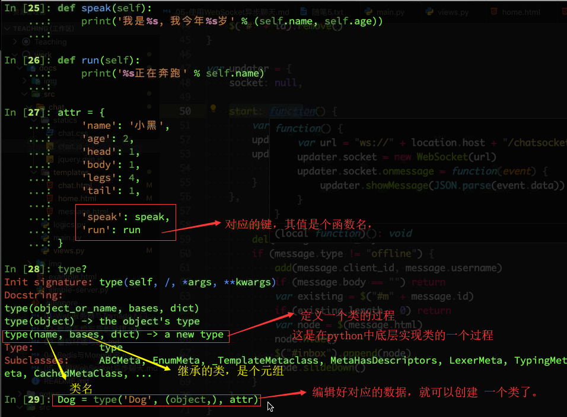

**解决**：服务器主动可以与用户通信，传统的都是用户访问服务器，现在让服务器实时的通知我信息。

传统的解决：

+ 短轮询

​	定一个循环，不断刷新网页 ----- 短轮询 Polling  （ajax来实现）

​	优点：短连接，服务器处理简单

​	缺点：有一定延迟，对服务器压力很大，浪费带宽。大部分是无效的请求

+ 长轮询

   对短轮询进行了改进，在用户发送请求，有数据的话，服务器会发给用户。如果没有数据，那么服务器会等待数据，在等待时间中，有超时问题，504错误就是超时，时间过了 。再次让用户请求服务器。


#### 什么是websocket

是一种网络通信协议，是H5开始提供的一种在单个tcp连接上的进行全双工通信协议，没有了Request和Response的概念，两者地位平等，连接 一旦建立，就建立了持久性连接，浏览器和服务器双方可以随时向对方发送数据。

全双工：同时双向的通信，如tcp、udp

半双工：只能单向。比如火车一样共用 一个轨道，两者进行协商，规定a到b，或者b到a


#### 与普通的HTML协议差别

+ webSocket协议的url地址：`ws://`、`wss://`开头的，并不是 `http://`、`https://`
+ webSocket使用的与普通的HTML或者html5协议相同的端口 80 和443 端口进行连接

+ websocket的头部header的有些**特殊的字段：**

  ​		`Connection:Upgrade ` ==>相当于http升级到了websocket 协议
  ​		`Uphrade:websocket`

  

#### 前端：使用JS来实现   

```
var ws = new webSocket('ws://example.com/socket');  
ws.onopen = function(){
	ws.send("建立连接，我是客户端")
};
ws.onmessage = function(event){   # 需要事件参数 event
	console.log("客户端接收："event.data)
};
ws.onclose = function(){
	ws.send("客户端已断开")
};

```

**tornado中使用webSocket**， tornado在很早之前就把webSocket纳入了框架中

```
下面是一些钩子函数：
open  连接建立好一些处理
on_close   连接断开时一些处理
on_message   接收到消息时，处理函数
write_message   给客户端发送一些消息

可以把上面的函数称为 钩子函数  （当某一事件触发时，执行该函数 称为 钩子函数）

例如：
class WebSockethandler(tornado.websocket.WensocketHandler):
	def open(self):
		'''建立连接时执行的操作'''
		pass
	def on_message(self,message):
		#接收数据时的执行操作
		pass
	def on_close(self):
		# 断开连接时执行的操作
		pass
	def write_message(self,message):
		#可以给其他人发送信息
		pass
		
```

实例：

```
import time
import …………

class MsgHandler(tornado.websocket.WebSocketHandler) //继承tornado中webSocket协议，
	def open(self)：
		print（'有客户端建立连接'）
	
	def on_message(self,message):
		print("收到了客户端的消息%S"%message)
		self.write_message("收到你的消息%s" %message) ==>返回给客户端消息
		
	def on_close(self):
		print("客户端断开了连接")
	
def make_app():
	return tornado.web.Application([r"/msg"],MsgHandler)
if __name__ == "__main__"
	……
	
建立好之后，需要在控制台，console中编辑js，
客户端如何接受服务器发送的信息呢？那么需要绑定onmessage函数
var ws = new webSockert()

ws.onmessage = function(event){  #event是个事件对象
	console.log("客户端收到了：",event.data)  #打印了服务器的发送的消息
};

```





实现群聊：

```
每个人和服务器连接，都会产生一个self实例
……
	定义一个集合存连接时的对象
	conn_pool = set()
	def open(self):
		print("客户端和我建立连接")
		self.conn_pool.add(self) 
	def on_message(self,message):
		self.broadcast(message)
	
	def on_close(self):
		self.conn_pool.remove(self)  //断开连接，把连接池中的对象删除的
		
	def broadcast(self,message):  //定义个函数，给所有对象发送信息
		for conn in self.conn_poll:
			if conn is not self:
				conn.write_message(message)

```

完善群聊功能 ： 登录、界面、离线消息(比如100条消息)、


python**日志模块 logging**   打印日志用的

//下面是级别越来越高，**如果设置的级别越高，那么低与该级别就无效了，越低日志就产生的越多**

```
// 等级依次增高
logging.debug()     调试
logging.info()      信息    
logging.warning()   警告
logging.error()   错误
logging.fatal()    致命错误
```


#### **cookie** 缓存

**把用户提交的用户记录到cookie缓存中**

**set_cookie**('username',b64_username)   # **set_cookie** 支持ascii码，b64_username就是转换的ASCII码。需要导入 import base64 ，

**get_cookie**(’username‘)   ==> 这是得到cookie缓存中的数据，键为 username 


#### base64模块

比如：首先导入 base64模块

```
import base64
s = '上号'.encode('utf8')   => 先转换成二进制，在用base64 转成ascii
b64_str = base64.encodebytes(s) ==> 对字符转换成ascii码值

同样解码也是一样的
```

base64是8位8位的编码，如果**结尾位数不足**的话，用=号补位，最多是==两个等号

进行页面的提交，一些url的中文，还有在git中的ssh中的公钥的编码

解码也是一样。base64.decodebytes(x) ==> x是ascii码解码成二进制，在用decode解码二进制。



#### uuid模块

uuid  全局唯一id  

import uuid 

print (uuid.uuid4)  =>产生唯一的id， 比较常用的uuid4， 


redis处理历史消息，json文件不能直接写入大Redis中，应该先把json.dumps转为字符


在python中  **类都是有type 创建**的。  





